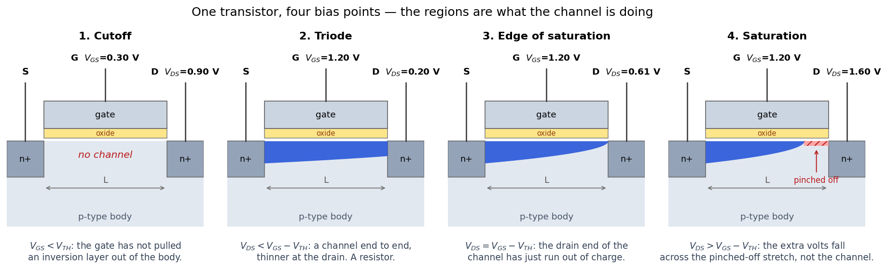

# A MOSFET is a valve

**Question this page answers:** *Everyone says a transistor is a switch. So why does my
textbook give me three different equations for it?*

Because it is a switch you can **squeeze**.

Think of a garden hose with your hand around it. Squeeze hard and nothing gets through.
Release completely and water flows freely, limited only by the tap. In between — and *in
between is where every amplifier on earth lives* — the hose is a resistor whose value your
hand sets. One device, three behaviours, and which one you get depends entirely on how hard
you are squeezing and how hard the tap is pushing.

The three equations in your textbook are not three devices. They are three descriptions of
one channel, in three states.

## The four terminals, and which one is your hand

A MOSFET has four terminals, and only one of them is the hand:

| Terminal | What it does | Its water analogue |
|---|---|---|
| **Gate** (G) | sets how open the channel is | your hand on the hose |
| **Source** (S) | where the carriers come from | the tap end |
| **Drain** (D) | where they go | the open end |
| **Body** / bulk (B) | the silicon everything is built in | the ground the hose lies on |

The single most important fact about the gate is what it is *made of*. **MOS** stands for
**Metal–Oxide–Semiconductor**, and the middle word is an insulator. The gate is a plate of
conductor sitting on a few nanometres of silicon dioxide — glass — on top of the silicon. It
is a capacitor, not a connection. You can ask ngspice how big a capacitor: for the W = 5 µm,
L = 1 µm device this course measures, `@m.xm1.msky130_fd_pr__nfet_01v8[cgg]` comes back as
**30.56 fF** at $V_{GS} = V_{DS} = 1.8$ V.

So **no steady current flows into the gate at all**. You are not injecting anything. You are
parking charge on a plate, and the electric field from that charge reaches through the glass
and pulls mobile electrons up to the surface of the silicon underneath, out of the p-type
body that had none to spare. Those electrons are the channel.

That is why the terminal is called a *gate* and not an *input*: it costs you charge to move
it, and nothing while you hold it. Every "the gate is high impedance" claim you have ever
read is this one physical fact.

> **Body is a terminal, not a detail.** In this course the body is wired to the source on
> every NMOS, which is what makes the four-terminal device behave like the three-terminal one
> in your textbook. It is not free — [Threshold is not a
> constant](guide/threshold-is-not-a-constant.md) is entirely about what happens when you
> stop doing that.

## The picture that replaces the three equations

Here is the same transistor at four bias points. Nothing changes but the two voltages. Watch
the blue layer.



*Produced by `src/channel_picture.py` in the Lab 03 package. The blue layer's thickness is
proportional to the local inversion charge; the red hatch is the pinched-off stretch where
there is no channel left at all.*

Read it left to right and you have already met all three regions:

1. **Not squeezing hard enough** (panel 1). The gate voltage is too low to pull a channel
   out of the body. There is no conducting path from source to drain. **Cutoff.**
2. **Squeezing, small push** (panel 2). A channel runs end to end. It is a bit thinner at the
   drain, because the drain voltage partly cancels the gate's pull there. Current is
   proportional to push. **Triode** — a resistor.
3. **The drain end runs out** (panel 3). Push harder and the channel gets thinner at the
   drain end until, at one particular drain voltage, it has exactly zero charge there.
4. **Push harder still** (panel 4). The zero-charge point moves back from the drain, and all
   the extra volts you added fall across that pinched-off stretch instead of across the
   channel. The channel itself sees the *same* voltage it did in panel 3, so it carries the
   *same* current. **Saturation** — a current source.

The thing worth carrying out of this page is the last sentence. Saturation is not "the
current stops increasing because the equation says so." It is: **the part of the device that
sets the current stopped seeing your extra voltage.**

<!-- The Manim animation of this page's central idea. Renders to
     dist/MosfetChannel.web.mp4 from tooling/manim/scenes/ad103_mosfet_channel.py;
     deploy copies it here alongside its poster frame. -->
<video controls loop muted playsinline preload="none"
       poster="assets/img/ad103-mosfet-channel.poster.png"
       style="width:100%;max-width:820px;border-radius:8px">
  <source src="assets/img/ad103-mosfet-channel.web.mp4" type="video/mp4">
  Your browser will not play embedded video —
  <a href="assets/img/ad103-mosfet-channel.web.mp4">download the clip</a>.
</video>

*The four panels above, animated: $V_{GS}$ and $V_{DS}$ move continuously while the
$I_D$–$V_{DS}$ curve traces out alongside. Source:
[`tooling/manim/scenes/ad103_mosfet_channel.py`](https://github.com/uoftasic/ad103) —
`MosfetChannel`. Watch it once before Lab 03 and once after; it lands differently.*

## Try this — the squeeze, measured

Everything above is a claim about silicon. Here is the claim in microamps. In the workbench:

```bash
. /foss/designs/common/.designinit
mod ad103
cd labs/lab-03-mosfet-regions
make
```

About **twenty seconds** (13–22 s across five runs on the reference machine), and it ends in
a verdict. Then:

```bash
make extract
```

The first block it prints is the whole page:

```
== I_D vs V_DS   (W=5, L=1)
     V_GS  I_D at V_DS=1.8   knee V_DS   channel R at V_DS=10 mV
     0.60         2.005 uA       0.09 V              26648.3 ohm
     0.90        63.876 uA       0.29 V               2529.2 ohm
     1.20       217.505 uA       0.50 V               1288.0 ohm
     1.50       436.080 uA       0.70 V                907.7 ohm
     1.80       696.275 uA       0.89 V                736.9 ohm
```

**What you should see.** Look at the last column and forget everything else for a second.
That is the resistance of the channel, measured with 10 mV across it — small enough that the
transistor is unambiguously a resistor. It goes from **26.6 kΩ** to **737 Ω** as the gate
walks from 0.6 V to 1.8 V. A 36-fold change in resistance, with no moving parts, controlled
by a voltage on a plate of glass.

That is the squeeze. It is not on-or-off; it is a dial.

**And the off end is not zero.** Take the gate all the way down:

```
== below threshold   (V_DS = 1.8 V)
   V_GS = 0.00 V   I_D = 2.1853e-12 A
```

**2.19 picoamps** with the gate at ground and 1.8 V across the device — 320 million times
less than the 696 µA it passes wide open, and still not zero. Hold on to that number;
[Four regions, not three](guide/four-regions-not-three.md) is largely about it.

**Why an engineer cares.** Both halves matter, and they pay different bills. The 737 Ω is why
a digital gate can charge the next gate's input in picoseconds — that is your clock speed. The
2.19 pA is why your phone's battery drains while it sits on the table doing nothing — that is
leakage, and on a chip with ten million transistors it is the design constraint that has
dominated the last twenty years of the industry.

**The reflex check:** if someone hands you a transistor and calls it a switch, ask *"what is
its on-resistance and what is its off-current?"* Both are finite, both are numbers you can
measure in an afternoon, and neither appears anywhere in the word "switch".

## ⚠ Before you edit any deck: `W=5`, never `W=5u`

Everything in this course is one keystroke away from an error message that does not say what
is wrong. In SKY130, **`W` and `L` are plain micron numbers with no unit suffix.** `W=5` means
five micrometres. `W=5u` means five *metres*.

The lab ships a deck that gets this wrong on purpose, so you can meet the error under
controlled conditions:

```bash
make wrong-units
```

```
Error on line 13 or its substitute:
  m.xm1.msky130_fd_pr__nfet_01v8 d g 0 0 xm1:sky130_fd_pr__nfet_01v8__model l=    1.000000000000000e-06     w=    5.000000000000000e-06 ...
could not find a valid modelname
    Simulation interrupted due to error!

Error: incomplete or empty netlist
       or no ".plot", ".print", or ".fourier" lines in batch mode;
no simulations run!
```

`could not find a valid modelname` is almost never a missing model. The SKY130 models are
**binned** — each `.model` card covers a range of widths and lengths, written in microns — and
a width of `5e-06` metres falls outside every bin, so nothing matches and ngspice stops.
[Getting started §8](guide/getting-started.md) has the full autopsy, including what the `u`
does to six other numbers on its way through XSchem.

**The reflex check:** every `W=` and `L=` you type is a bare number. A letter after it costs
twenty minutes.

## What a valve is good for

Two jobs, and the regions map onto them exactly:

- **Switching.** Drive the gate all the way to 1.8 V or all the way to 0 V and never linger in
  between. You are using cutoff and triode, and you care about 737 Ω and 2.19 pA. This is the
  whole of digital design — every gate in the DD track is transistors used this way.
- **Amplifying.** Park the gate somewhere in the middle, keep the drain high enough that the
  channel stays pinched off, and wiggle. You are using saturation, and you care about how much
  the current moves per volt of wiggle. That number is called $g_m$, and it is the subject of
  [$g_m$ and $r_o$](guide/gm-and-ro.md).

An amplifier and a logic gate are the same three-terminal device biased in different regions.
That is not a cute observation; it is why [The inverter is an
amplifier](guide/the-inverter-is-an-amplifier.md) is a real page later in this course and not
a metaphor.

Next: [Four regions, not three](guide/four-regions-not-three.md) — the boundaries drawn on
your own measured curves, and the region your textbook told you does not exist.
