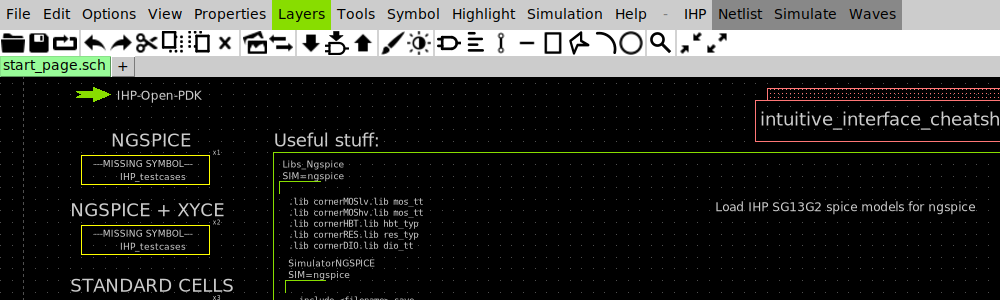
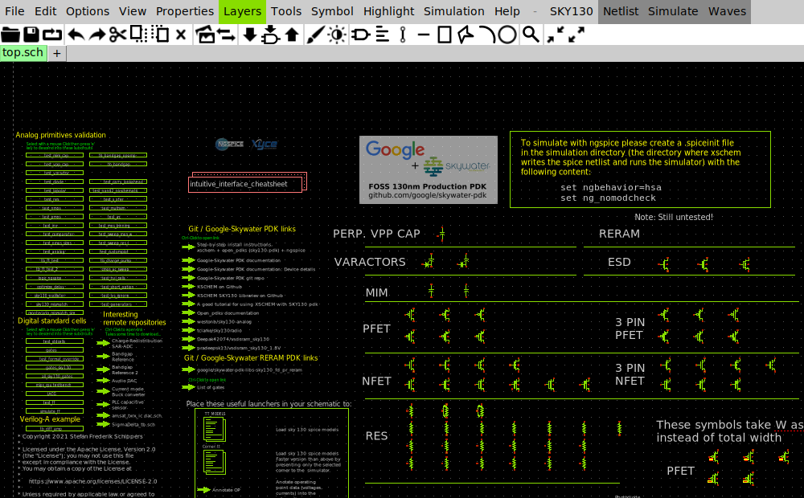
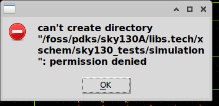
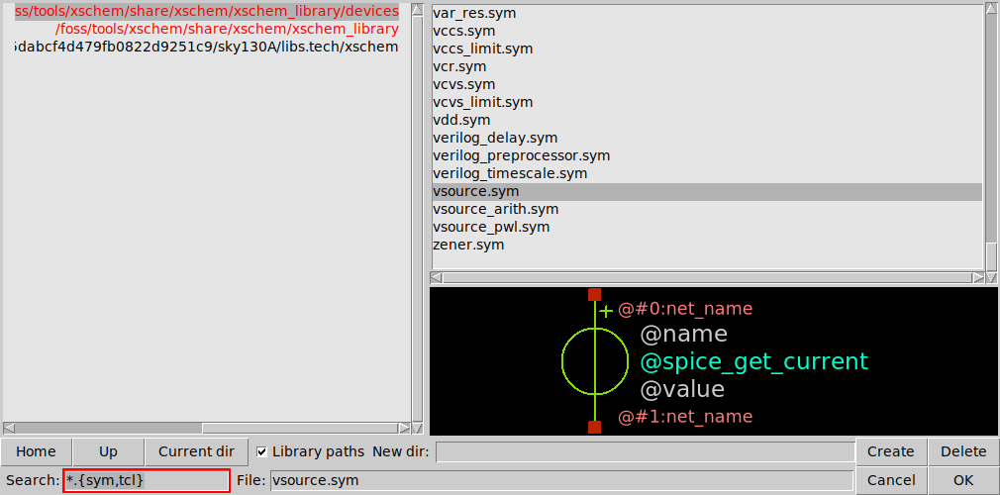
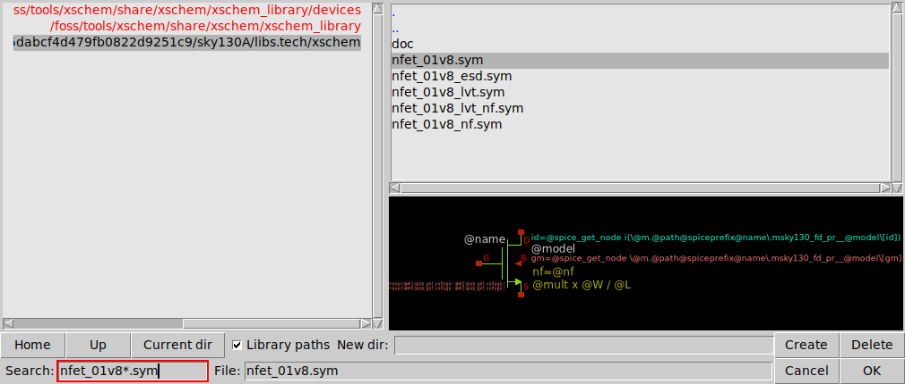
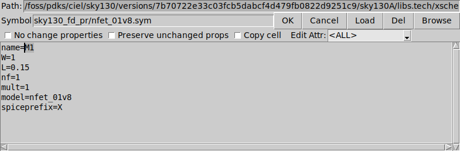
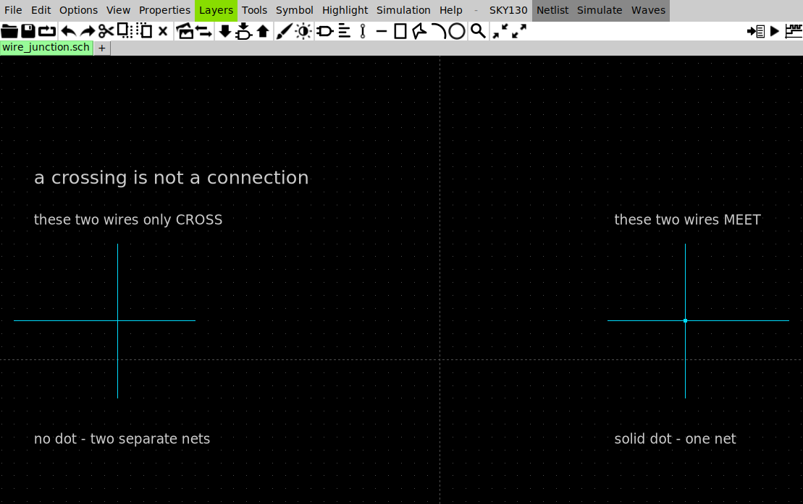
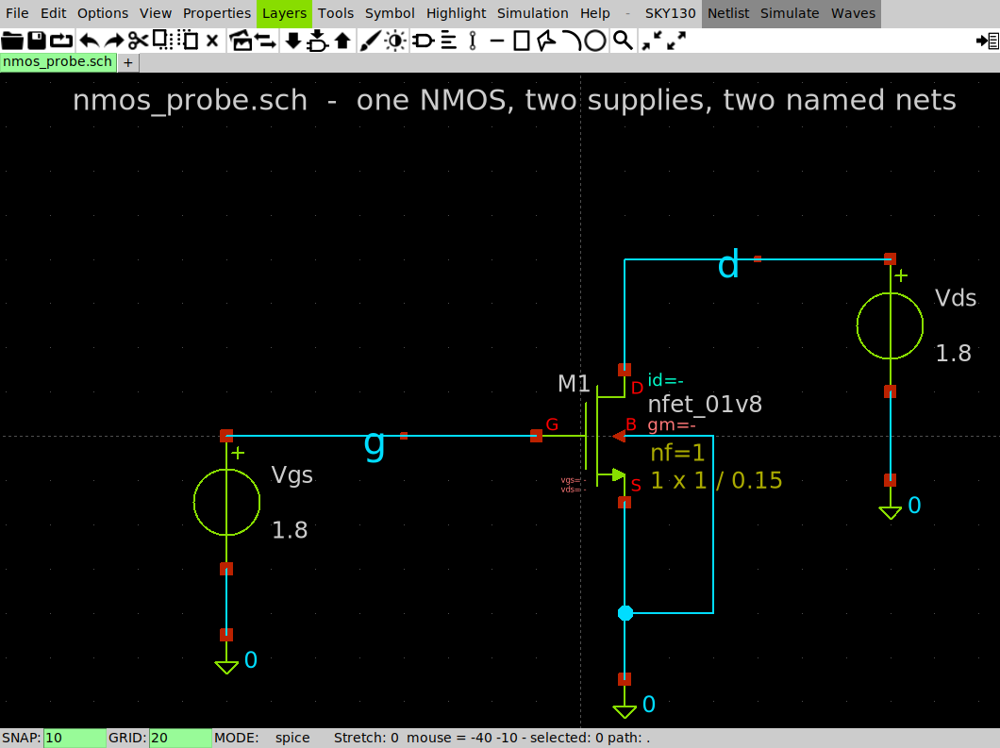
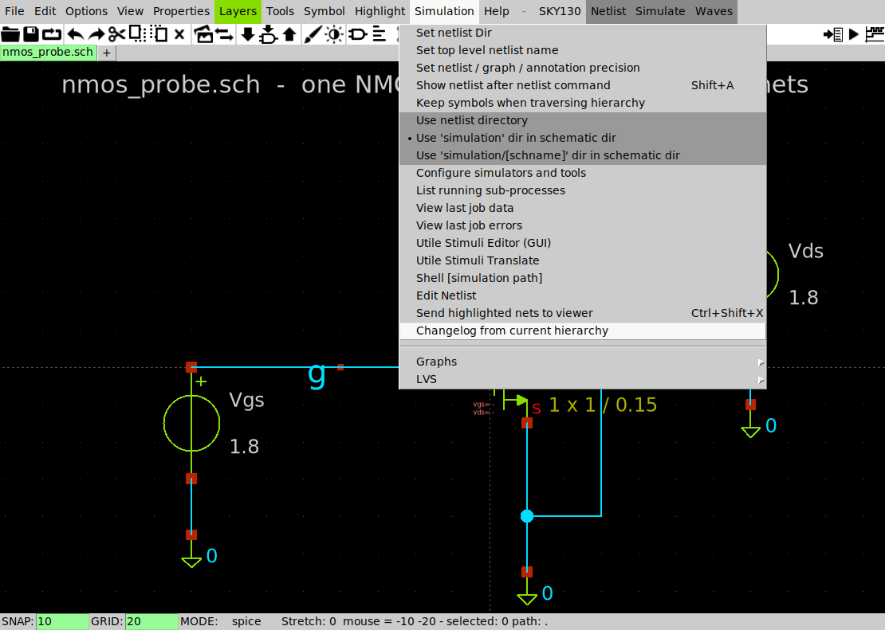
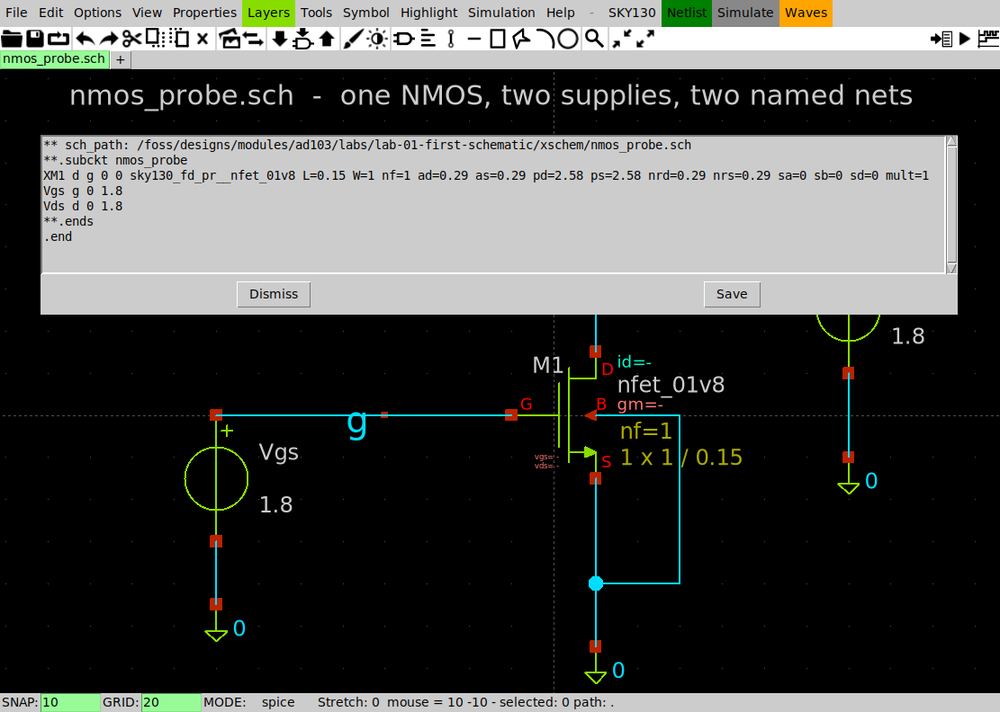

# Getting started

**Question this page answers:** *How do I get from a browser tab to a schematic I drew myself,
turned into SPICE, with a number at the end?*

AD103's tool is **XSchem** — a schematic editor. You draw a circuit, it writes the SPICE
netlist, ngspice simulates it. You have almost certainly never used it, and this page assumes
that. It is longer than the other getting-started pages in this track because learning the
editor *is* the first lesson.

Nothing here installs anything. AD103 needs **one Docker image and a browser**, and you already
have both from [IC101](https://uoftasic.com/ic101/).

## 1. Start the desktop

On your own machine, in your `workspace` clone:

```bash
cd workspace
./scripts/start_vnc.sh          # Windows: scripts\start_vnc.bat
```

Open **http://localhost/** and open a terminal on that desktop. Every command below is typed
*inside* that terminal, not on your laptop.

Ports, passwords, resolution, and what to do when the page is blank:
[IC101 — Launch the noVNC desktop](https://uoftasic.com/ic101/#/guide/launch-novnc).

## 2. Load the environment — and check the PDK

```bash
. /foss/designs/common/.designinit
```

```
ASIC-EDU: PDK=sky130A  PDK_ROOT=/foss/pdks  designs=/foss/designs
          run 'mod' to list course modules, or 'mod <name>' to enter one.
```

That leading `.` is the shell's `source`. It runs the file *in your current shell*, which is
the only way a script can change your environment. You must do this **in every new terminal**;
it does not stick.

**This banner is not decoration.** Check what `PDK` was before you ran it:

```bash
echo $PDK
```

```
ihp-sg13g2
```

`ihp-sg13g2` is a real 130 nm process from IHP in Germany, and it is the image's default. AD103
is entirely on **SKY130**. This matters more in AD103 than anywhere else in the curriculum,
because **XSchem reads `$PDK` at launch to decide which device library to load** — and it
does not tell you which one it picked.

### What the wrong PDK looks like

Launch XSchem with the default and you get a perfectly healthy-looking editor, showing this:



*Menu bar says **IHP**. Tab says `start_page.sch`. The page offers to load "IHP SG13G2 spice
models". No error, no warning, no complaint.*

Every `sky130_fd_pr/...` symbol this course names will simply not exist, and the netlist will
say `IS MISSING !!!!` next to your transistor while still exiting successfully.

**The reflex check, before anything else:** `echo $PDK` says `sky130A`, and XSchem's menu bar
says **SKY130**. Two seconds, and it rules out the single most confusing failure in this course.

## 3. Get the course files

```bash
mod add ad103      # first time only — clones github.com/uoftasic/ad103
mod ad103          # every time after that
```

```
Cloning https://github.com/uoftasic/ad103.git
     into /foss/designs/modules/ad103
Cloning into '/foss/designs/modules/ad103'...
OK  module ready: /foss/designs/modules/ad103
    run: mod ad103
cwd: /foss/designs/modules/ad103
```

`mod` is a shell function `.designinit` defines. Everything lands under
`/foss/designs/modules/`, which is your `workspace` folder bind-mounted into the container.
Your files are on **your** disk; deleting the container does not delete your work.

| What you see | What it means |
|---|---|
| `bash: mod: command not found` | You did not run step 2 *in this terminal*. Every new tab starts clean. |
| `mod: no such module: ad103` | You ran `mod ad103` before `mod add ad103`. |
| `fatal: could not read Username for 'https://github.com'` | git is being asked to log in, which means it could not read the repo anonymously. Check the spelling; if it is right, ask in [Discord](https://discord.gg/hrJnP5UsGz) — do not type your password. |

## 4. Check your versions

```bash
xschem --version
ngspice -v
```

```
XSCHEM V3.4.8RC
Copyright (C) 1998-2024 Stefan Schippers
```

```
******
** ngspice-46 : Circuit level simulation program
** Compiled with KLU Direct Linear Solver
** The U. C. Berkeley CAD Group
** Copyright 1985-1994, Regents of the University of California.
```

**`3.4.8RC` and `ngspice-46` are the numbers that matter.** XSchem's keybindings and menu
layout have changed between releases; if you see a different version, screenshots on this page
may not match your window.

## 5. Open XSchem — on a schematic in your own directory

```bash
cd /foss/designs/modules/ad103/labs/lab-01-first-schematic/xschem
xschem nmos_probe.sch &
```

Three rules that will save you an hour each:

- **Launch it from a terminal, never from a desktop icon.** Some of XSchem's messages go to the
  terminal it was started from. Started from a menu, those go to a terminal that does not
  exist, and you get a program that silently does nothing.
- **Launch it from the directory your schematics are in.** XSchem reads `./xschemrc` from
  wherever it starts. `lab-01-first-schematic/xschem/` has one, and it is what makes the SKY130
  symbols resolve and puts your netlists somewhere you can find them.
- **Name the file you want to open.** With no filename XSchem opens whatever its config calls
  the *start page* — and that is where the first hour of this course goes to die. Read on.

### ⚠ Do not draw on the start page

Bare `xschem &` opens the start page. Every AD103 lab directory sets that to a blank
`untitled.sch` **in the lab directory**, so inside a lab folder a bare `xschem &` is harmless.
Anywhere else — a scratch folder of your own, with no `xschemrc` — the SKY130 PDK's own start
page comes up instead:



*Menu bar reads **SKY130**. The canvas is a live schematic — those NFET, PFET, RES, MIM and
VARACTOR rows are real symbols. It looks exactly like a page you could work on. It is not.*

That page is a real file, and it lives at
`/foss/pdks/sky130A/libs.tech/xschem/sky130_tests/top.sch` — **inside the PDK, which is
read-only.** Two things follow, and neither of them announces itself:

- `Ctrl-S` cannot write it. XSchem asks `save file?`, you say **Yes**, and it answers with a
  box reading **`file opening for write failed!`** — after which the tab still carries its `*`
  and the file on disk is untouched. Nothing appears in the terminal.
- Clicking **Netlist** — §10 — writes the netlist *next to the schematic*, so it tries to
  create a `simulation/` folder inside the PDK and stops with a modal box:



```
can't create directory
"/foss/pdks/sky130A/libs.tech/xschem/sky130_tests/simulation": permission denied
```

Nothing is wrong with your install, your PDK or your drawing. You are simply standing in a
read-only folder. **Open a schematic that lives in your own directory and the error is gone** —
which is what the command at the top of this section does.

Spend a minute on `nmos_probe.sch` before you change anything. Pan and zoom until it stops
feeling random. It is the circuit §9 and §10 are about.

## 6. The keys you actually need

XSchem has several hundred bindings. These cover this entire course. They come from XSchem's
own list — **Help → Keys**, or press `/` for a full-screen poster of them.

| Do this | Key |
|---|---|
| Zoom to fit | `f` |
| Zoom in / out | mouse wheel, or `Shift-Z` / `Ctrl-Z` |
| Pan | hold `Space` and drag, or drag with the middle button |
| Insert a symbol | `Shift-I` (or `Ins`) |
| Draw a wire | `w` — press it at one end, then click the other |
| Draw a wire whose **ends** snap onto the nearest pin | `Shift-W`, and hold `Shift` for the closing click too |
| Place a net label | `Alt-L` |
| Edit the selected thing's properties | `q` |
| Duplicate / move / delete selection | `c` / `m` / `Delete` |
| Undo | `u` |
| Save | `Ctrl-S` |
| Abort whatever you started, and unselect | `Escape` |
| Help | `?` |

Three of these will catch you out, because your text editor uses them for something else:

- **`c` duplicates** the selection. Plain `Ctrl-C` is a different, less useful copy.
- **`u` is undo.** `Ctrl-Z` is *zoom out*.
- **`q` opens properties.** It does not quit.

The full list, with the menu equivalents: [XSchem cheat sheet](reference/xschem-cheatsheet.md).

## 7. Place a transistor

Press `Shift-I`. A symbol chooser opens:



*Left pane: the symbol libraries XSchem knows about. Right pane: the current directory.
**Search** filters by pattern. Pick a file — `vsource.sym` here — and the pane underneath draws
the symbol, so you can check you have the right one before you place it. Press **OK**, or
double-click the file, and the symbol attaches to your cursor — click to drop it.*

Look at the left pane, because it is a second PDK check. Three paths are listed, and the third
is `…/sky130A/libs.tech/xschem`. If that line is missing or says `ihp-sg13g2`, go back to §2
before you draw anything.

The right pane opens on XSchem's built-in **`devices`** library, and you need four things from
it all course: `vsource.sym` (a voltage source), `gnd.sym` (ground), `lab_pin.sym` (a net
label), and `capa.sym` (a capacitor).

The transistors live elsewhere. Click the `sky130A` line on the left, open **`sky130_fd_pr`**,
and replace the **Search** text with `nfet_01v8*.sym` to cut the library's 77 symbols down to
five. It is a glob, not a substring search, so `nfet` on its own matches nothing. What you want
is:

- **`nfet_01v8.sym`** — the 1.8 V n-channel MOSFET, the workhorse of this process
- **`pfet_01v8.sym`** — its p-channel twin
- **`diode.sym`** — Lab 02's subject



*The same chooser after clicking the `sky130A` line on the left and typing `nfet_01v8*.sym` into
**Search**: the whole `sky130_fd_pr` library cut down to five files. The preview underneath shows
the symbol with its attributes still as placeholders — `@name`, `@model`, `@mult x @W / @L` —
because they are filled in per instance, which is what §8 is about.*

Why those names, and what the other seventy-odd devices are for:
[Which SKY130 device is which](reference/sky130-device-guide.md).

> **The chooser opens somewhere unhelpful — in two different senses.** It remembers the
> directory you were last in, which is a feature right up until it isn't; click **Home** to
> jump back to the top of the tree. It also opens *positioned* relative to the main XSchem
> window, and because that window is nearly as wide as the screen, on a 1280-wide desktop the
> chooser lands mostly off the right edge — the library pane this page tells you to click, the
> file list, the Search box and **OK** can all be past it. Drag it back by the sliver of title
> bar that is on screen (or alt-drag anywhere in it) before you try to use it. It stays where
> you put it for the rest of the session. `q`'s **Edit Properties** window does the same thing.

## 8. ⚠ `W=1`, never `W=1u`

Select the transistor and press `q`:



*One attribute per line. `W=1` and `L=0.15` are the only two you will normally change. `nf`,
`mult`, `model` and `spiceprefix` come from the symbol — leave them alone.*

**`W` and `L` are plain micron numbers with no unit suffix.** `W=1` means one micrometre.
Writing `W=1u` means one *metre*, and this is the single most common mistake anyone makes with
SKY130. Everyone hits it at least once. Here is exactly what happens, so you recognise it
instead of debugging it.

XSchem accepts `W=1u` without a murmur and writes this device line:

```
XM1 d g 0 0 sky130_fd_pr__nfet_01v8 L=0.15u W=1u nf=1 ad=2.9e-07 as=2.9e-07 pd=0.580002 ps=0.580002 nrd=290000 nrs=290000 sa=0 sb=0
+ sd=0 mult=1
```

Look at what those two `u`s did on their way through. The symbol computes the diffusion areas
and resistances *from* `W`, so `nrd` went from `0.29` to `290000` and `ad` from `0.29` to
`2.9e-07`. Two characters poisoned six more numbers, and XSchem reported none of it.

ngspice is the one that finally objects, and it does it like this:

```
Error on line 13 or its substitute:
  m.xm1.msky130_fd_pr__nfet_01v8 d g 0 0 xm1:sky130_fd_pr__nfet_01v8__model l=    1.500000000000000e-07     w=    1.000000000000000e-06     nf=    1.000000000000000e+00 ...
could not find a valid modelname
    Simulation interrupted due to error!

Error: incomplete or empty netlist
       or no ".plot", ".print", or ".fourier" lines in batch mode;
no simulations run!
```

**`could not find a valid modelname` almost always means a unit suffix on `W` or `L`.** The
SKY130 models are *binned*: each `.model` card covers a range of widths and lengths, and the
model file is written in microns. A width of `1.000000000000000e-06` — which is what `1u` is,
in metres — falls outside every bin, so no model matches, so ngspice stops.

You can prove the whole thing to yourself in five seconds, and you should:

```bash
cd /foss/designs/modules/ad103/labs/lab-01-first-schematic
make wrong-units
```

That target exists for exactly this. It runs a shipped deck whose device line differs from the
working one by two characters, prints the error above, and tells you to `diff` the two files.

**The reflex check:** every `W=` and `L=` you type is a bare number. If you typed a letter
after it, you are about to spend twenty minutes on this.

## 9. Wire it up

Put the pointer on the first end, press `w`, move to the second end, and click. The key is
what anchors the start — `w` grabs wherever the pointer already is, so pressing `w` and *then*
clicking two places draws a wire from wherever you were parked to the first click, and nothing
at all between the two places you clicked. That places **one straight segment** — for an
L-shape, draw two.

Two things about wires that cost everyone their first half hour:

- **Your wires may come out diagonal.** XSchem's routing mode has an oblique setting, and it is
  not always off. Press `Space` *while a wire is in progress* to cycle between
  horizontal-then-vertical, vertical-then-horizontal, and straight diagonal. `Escape` throws
  away a wire you started by mistake.
- **A wire connects only where an endpoint lands on a pin or on another wire.** Two wires that
  merely cross do not connect. XSchem draws a small solid dot at a real junction — there is one
  in `nmos_probe.sch` further down this page, where the body and source wires meet — and draws
  nothing where two wires simply pass over each other. If you are not sure a wire will land on a
  pin, use **`Shift-W`** instead of `w` — but hold `Shift` down for the closing click as well.
  `Shift-W` snaps the end you *start* from onto the nearest pin or net endpoint however far away
  it is; the click that finishes the wire is an ordinary click, and an ordinary click lands on
  the snap grid. It will pull onto a pin that is already within about one snap step, which is
  why the mistake is intermittent rather than obvious. Measured on a pin 28 units away: plain
  closing click landed on the grid 28 units short; `Shift` held for the closing click landed
  exactly on the pin.



*The same picture twice. On the left, one wire runs over another and XSchem draws nothing at the
crossing: two separate nets that happen to overlap on screen. On the right, four wire ends land
on the same grid point and XSchem draws the dot: one net. **The dot is the whole difference**,
and it is a few pixels wide — zoom in on every junction before you netlist.*

For anything longer than a few centimetres of screen, don't draw a wire at all — **name the net
instead**. Press `Alt-L`, drop a `lab_pin` on the wire, and press `q` to set its `lab` property
to a name. Two labels with the same name are the same net, wherever they are on the page. Every
supply and ground connection in this course is made that way.

Here is the finished article — the schematic you are about to netlist:



*One `nfet_01v8` with `W=1`, `L=0.15`. `Vgs` drives the gate through a net labelled `g`; `Vds`
drives the drain through `d`. Source and body both go to ground — that is the filled cyan dot,
a real junction. The status bar reads `SNAP: 10  GRID: 20  MODE: spice`: snap is why your wires
land exactly on pins instead of near them.*

> **Cannot see that status bar?** On the default 1280×800 desktop XSchem opens 764 px tall at
> 29 px down, which puts its last 24 px — the status bar — behind the Xfce taskbar. Drag the
> window's bottom edge up a little, or start the desktop bigger
> (`VNC_RESOLUTION=1920x1080 ./scripts/start_vnc.sh`). The bar is worth having: it is where
> XSchem tells you what mode you are in.

Note what the symbol tells you before you simulate anything: `nfet_01v8`, `nf=1`, and
`1 x 1 / 0.15` — that is `mult × W / L`. XSchem annotates the size on every device, so you can
audit a page of transistors at a glance.

`Ctrl-S` saves — but it does not save straight away. Every time, on a perfectly writable file,
it raises a small modal window titled **Ask Save** reading `save file?` with **Yes / Cancel /
No**, placed wherever the pointer happens to be. Nothing reaches disk until you press **Yes**
(or `Return`), and the tab keeps its `*` until you do. Press `Ctrl-S`, look away, and run
`make mine`, and you will be checking the *last* version you saved — usually the one with no
transistor in it, which produces a confident `FAIL - the netlist has no nfet_01v8` and sends
you hunting for a placement bug that is not there. Save often; XSchem has no autosave, and the
tab title carries a `*` while you have unsaved changes.

`nmos_probe.sch` is the lab's **reference** — `make` in §11 checks against it, so it is the one
file in the course you want to keep exactly as shipped. Practise on it freely (`u` undoes any
number of steps) but do not save over it. If you already did,
`git checkout -- xschem/nmos_probe.sch` inside the module puts it back. When you want to build
one of your own from a blank start, Lab 01 hands you `xschem/my_probe.sch` — the same circuit
with the transistor left out — and `make edit` opens it.

## 10. Netlist it — and find where it went

Click **Netlist** in the menu bar — it is the grey button to the right of `SKY130`, visible in
the screenshot in §5. XSchem writes a SPICE file and says almost nothing about it. Two things
surprise everyone:

**Where it goes.** By default the netlist lands in `~/.xschem/simulations/` — a folder *inside
the container*, which is deleted when the container is. Your schematic is safely on your disk;
your netlist is not.

The fix is one menu click: **Simulation → Use 'simulation' dir in schematic dir**. Netlists
then land in `simulation/` right next to the `.sch` file, inside your bind-mounted module
folder. The lab packages set this for you in their `xschemrc`; a scratch directory of your own
will not have it.



*The three netlist-directory entries are radio buttons — exactly one is on. Here the bullet is on
the middle one, which is what `set local_netlist_dir 1` in a lab's `xschemrc` selects for you.*

**What it contains.** Open it:

```bash
cat simulation/nmos_probe.spice
```

```
** sch_path: /foss/designs/modules/ad103/labs/lab-01-first-schematic/xschem/nmos_probe.sch
**.subckt nmos_probe
XM1 d g 0 0 sky130_fd_pr__nfet_01v8 L=0.15 W=1 nf=1 ad=0.29 as=0.29 pd=2.58 ps=2.58 nrd=0.29 nrs=0.29 sa=0 sb=0 sd=0 mult=1
Vgs g 0 1.8
Vds d 0 1.8
**.ends
.end
```



*You do not have to leave XSchem to read it. Tick **Simulation → Show netlist after netlist
command** (`Shift-A`) and every press of **Netlist** pops the file up in a window with the
schematic still behind it — the drawing, and the text it just became, in one window.*

Six lines, and your whole drawing is in there. `XM1 d g 0 0` is the transistor and its four
terminals in order — **drain, gate, source, body**. The names are the labels you placed; `0` is
ground, which SPICE has always called zero.

Notice what is *not* there: no models, no analysis command. A netlist is only the circuit. The
`.lib` line that loads the SKY130 models and the `.control` block that says what to measure
live in the testbench, and Lab 02 is where you meet one.

### The one-line check that catches a bad drawing

Read the four node names on the device line. They should be exactly the nets you labelled.
Move that gate wire one grid step so it no longer quite touches the gate pin, netlist again,
and XSchem writes this — no error, no warning, exit 0:

```
XM1 d net1 0 0 sky130_fd_pr__nfet_01v8 L=0.15 W=1 nf=1 ...
```

`g` became `net1`. XSchem invents a name for every pin that isn't connected to anything, and
those invented names all look like `net` followed by a number.

**The reflex check:** after netlisting, `grep net[0-9] simulation/*.spice`. Any hit is a wire
you think is connected and isn't. This is faster and more reliable than squinting at the
canvas, and it is how you will find nine out of ten wiring mistakes in this course.

## 11. Prove the whole chain works

```bash
cd /foss/designs/modules/ad103/labs/lab-01-first-schematic
make
```

```
== netlisting xschem/nmos_probe.sch
   wrote xschem/simulation/nmos_probe.spice
== simulating spice/nmos_op.spice
   wrote results/nmos_op.log
== checking
  device line : XM1 d g 0 0 sky130_fd_pr__nfet_01v8 L=0.15 W=1 nf=1 ad=0.29 as=0.29 pd=2.58 ps=2.58 nrd=0.29 nrs=0.29 sa=0 sb=0 sd=0 mult=1
  drain current : 501.046 uA  (reference 501.046 uA)

PASS  netlist and operating point match the reference run
```

**501.046 µA.** That is a real SKY130 NMOS, one micrometre wide, 150 nanometres long, with
1.8 V on both the gate and the drain. Half a milliamp through a device you could fit two
thousand of across the width of a human hair. Hold on to that number — Lab 03 spends its whole
length explaining why it is that and not something else.

`make` needs no environment setup at all. The `Makefile` pins `PDK=sky130A` itself, so this
works in a bare container even if step 2 failed you. **If a page in this course ever seems to
be lying to you, come back here and run `make`.** A `PASS` means the problem is upstairs in
your drawing, not downstairs in your toolchain.

## 12. Why your simulations are about to get 30× faster

Every SPICE deck in this course loads the SKY130 models with a line like this:

```
.lib $PDK_ROOT/sky130A/libs.tech/ngspice/sky130.lib.spice.tt.red tt
```

Nearly everything you find online uses `sky130.lib.spice` instead — without the `.tt.red`.
Both give **exactly the same answer**: `i(vds) = -5.01046e-04`, to the last digit. The
difference is time. Measured on this image, same deck, same machine:

| Model library | Wall time |
|---|---|
| `sky130.lib.spice tt` | **74 s** |
| `sky130.lib.spice.tt.red tt` | **2.4 s** |

Those two numbers are one machine's; on a faster laptop the same pair measures 48 s against
2.0 s. The ratio is the part that travels.

The `.red` file is the typical corner pre-flattened; the plain one re-reads and re-parses the
whole corner tree, every run. A deck with **no** models at all runs in 0.013 s, so essentially
100 % of that 74 seconds is the model file.

That matters because 74 seconds of a completely silent terminal is indistinguishable from a
hang, and a hung program gets `Ctrl-C`'d. If you copy a deck off the internet and it seems to
freeze on startup, it hasn't — it is reading models. Swap in `.tt.red` and get on with your
afternoon. The other corners have their own files: `.ss.red`, `.ff.red`, `.sf.red`, `.fs.red`.

## When it goes wrong

| What you see | What it means |
|---|---|
| `could not find a valid modelname` | A unit suffix on `W` or `L`. See §8. |
| `*  M1 -  nfet_01v8  IS MISSING !!!!` in the netlist | XSchem could not find the symbol. Nearly always the wrong `PDK`: check the menu bar says SKY130, then `echo $PDK`, then relaunch XSchem. |
| `net1`, `net2`, … in your netlist | Unconnected pins. See §10. |
| Netlist file nowhere to be found | It went to `~/.xschem/simulations/`. See §10. |
| `can't create directory "/foss/pdks/sky130A/libs.tech/xschem/sky130_tests/simulation": permission denied` | You pressed **Netlist** while XSchem was showing the SKY130 PDK's own start page, which lives inside the read-only PDK. Netlists are written next to the schematic, so there is nowhere to put one. Nothing is broken — open a schematic in your own directory (`xschem nmos_probe.sch &` from `labs/lab-01-first-schematic/xschem/`) and netlist that. See §5. |
| `file opening for write failed!` when you save | Same cause, other end: the schematic you are editing is in a read-only directory — almost always the PDK start page. Your drawing is still in the window; **File → Save as** into your own folder rescues it. |
| `Error: incomplete or empty netlist` | ngspice hit an earlier error and gave up. Scroll **up**: the first `Error` line is the real one. |
| A blank rectangle with a name instead of a circuit | An unexpanded subcell. Descend into it with `e`, come back with `Ctrl-E`. |
| XSchem opens the wrong start page, or symbols vanish after it worked yesterday | You started it from a different directory, so it read a different `./xschemrc`. |

More, with the full text of each: [When ngspice complains](reference/ngspice-errors.md).

## You are ready when

```bash
. /foss/designs/common/.designinit
echo $PDK                                    # sky130A
mod ad103
xschem --version                             # XSCHEM V3.4.8RC
cd labs/lab-01-first-schematic && make       # PASS, 501.046 uA
```

and you can, without looking anything up:

- [ ] place an `nfet_01v8` and set `W` and `L` without the `u`
- [ ] draw a wire that is not diagonal, and land it on a pin
- [ ] name a net with `Alt-L` and connect two things by name alone
- [ ] save, netlist, and find the `.spice` file
- [ ] read the four node names on a device line and spot a `net7`

Next: [The straight line runs out](guide/the-straight-line-runs-out.md) — why the algebra AD102
gave you stops working the moment a diode enters the room, and what replaces it.

## Getting help

This course is self-paced, which is not the same as alone.

- **Ask in the [team Discord](https://discord.gg/hrJnP5UsGz).**
  There is no such thing as a question too basic. Most of what looks like a mistake in an EDA
  tool is the tool being unhelpful, not you — XSchem in particular fails quietly by design.
- **Quote the exact error, and say where it appeared.** Some of XSchem's messages go to the
  terminal it was launched from and some — including every one on this page — appear only as a
  modal box in the window, with the terminal completely silent. Paste the text either way,
  along with the command you ran and what `xschem --version` says.
- **Post a screenshot of the schematic.** Wiring problems are visible in one glance and
  invisible in a paragraph of description.
- **If a command on these pages does not do what the page says it does, that is a bug in the
  course.** Report it. Every command here was run before it was written, and every number was
  copied out of a real run — so a mismatch means something drifted, and we want to know.
