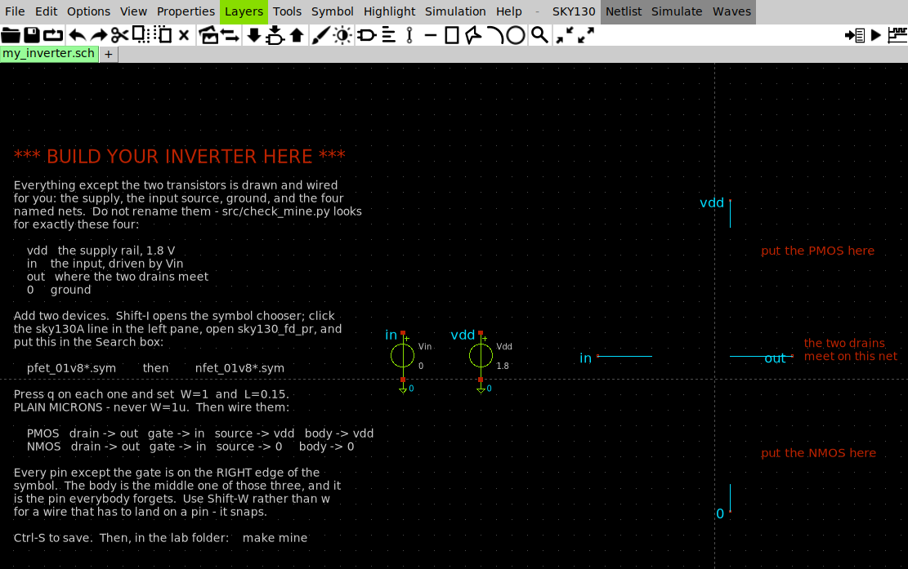
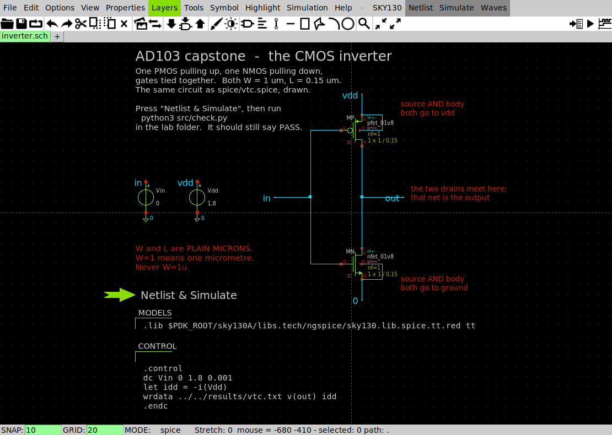
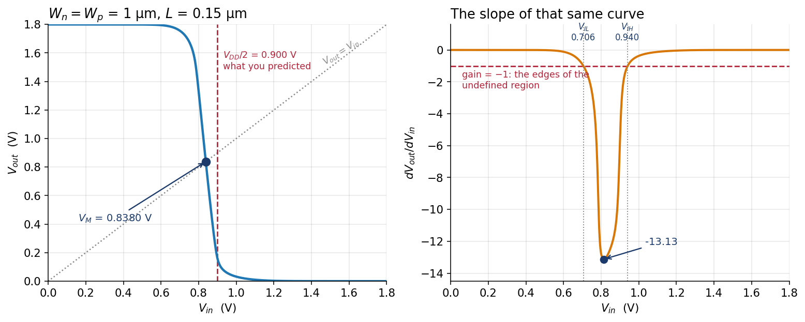
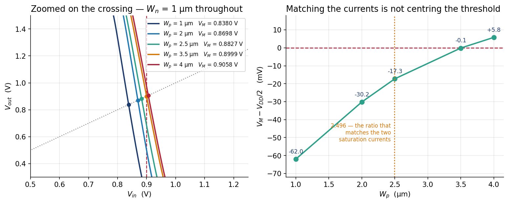
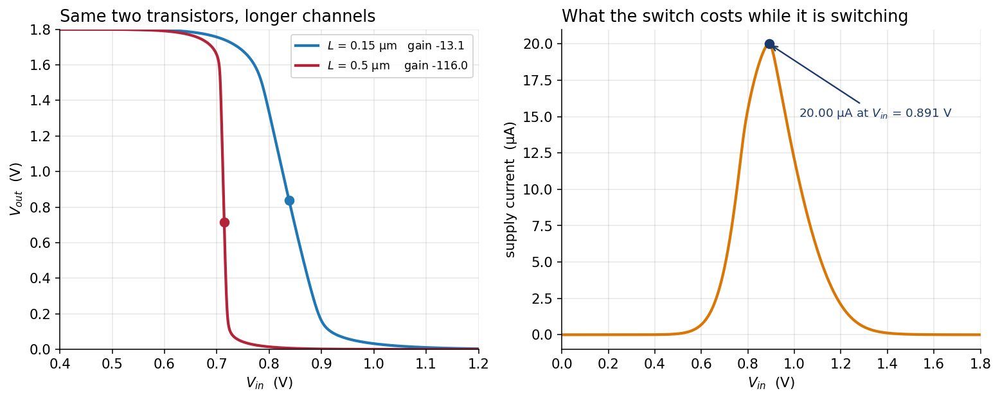
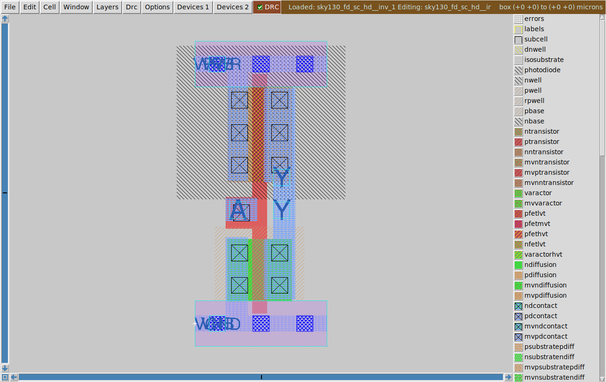

# Capstone — The CMOS inverter

Full runnable package:
[`labs/capstone-inverter/`](https://github.com/uoftasic/ad103/tree/main/labs/capstone-inverter).

Two transistors and one wire between them. You will draw it, measure the voltage at which it
switches, find that the number is not the one you predicted, fix it, find that your fix is also
not right, and then discover that both of your answers were correct — to two different
questions.

At the end of it you will have a schematic of a real logic gate, sized by you and verified
against a simulation, which is exactly the file **AD104** asks you to draw as geometry.

## Prerequisites

- [Lab 04 — $W/L$ is a knob](labs/lab-04-wl-knob-overview.md) done
- Read the Capstone movement: [The inverter is an
  amplifier](guide/the-inverter-is-an-amplifier.md)
- No environment setup. The `Makefile` pins `PDK=sky130A` itself

## Objectives

- Draw a CMOS inverter from two SKY130 transistors in XSchem and prove it is the same circuit
  as the shipped deck, to six digits
- Measure a voltage transfer curve and extract $V_M$, gain, $V_{IL}$, $V_{IH}$ and both noise
  margins from it
- Predict $V_M$, be wrong, fix it, be wrong again, and find out why both fixes were right
- Measure the propagation delay of your own gate and watch the two sizing criteria separate
- See the same two transistors behave as an amplifier with a gain of 116
- Read a wiring mistake that produces 1801 rows of perfectly valid, completely wrong data

## Theory (short)

At the switching threshold the input and the output are the same voltage, so **both**
transistors are saturated and carrying the same current:

$$
I_{Dn}(V_{GS}=V_M) \;=\; I_{Dp}(V_{SG}=V_{DD}-V_M)
$$

That is the whole of it. Notice what the condition is *not*: it is not "the two devices are
equally strong at full drive", and the difference between those two statements is the lab.

Gain at the switching point is the same expression every amplifier uses:

$$
A_v = -\,(g_{mn}+g_{mp})\,(r_{on}\parallel r_{op})
$$

## Procedure

```bash
cd labs/capstone-inverter
make            # about 13 s, ends in a verdict
```

| Target | What it does | Time |
|---|---|---|
| `make` | five ngspice runs, then check twelve numbers | ~13 s |
| `make edit` | open **your** schematic in XSchem | — |
| `make mine` | netlist and grade your schematic, then simulate it | ~5 s |
| `make extract` | six blocks of analysis, with the working shown | <1 s |
| `make figures` | redraw the three figures into `results/` | ~4 s |
| `make broken` | the PMOS source on the wrong node — **fails silently** | ~3 s |

### Step 1 — draw it

```bash
make edit
```



*Everything except the two transistors. `vdd`, `in`, `out` and `0` are already named and wired
— do not rename them, because `src/check_mine.py` looks for exactly those four.*

Add a `pfet_01v8` and an `nfet_01v8`, both `W=1` and `L=0.15`, then wire eight pins:

```
    PMOS   drain -> out    gate -> in    source -> vdd    body -> vdd
    NMOS   drain -> out    gate -> in    source -> 0      body -> 0
```

```bash
make mine
```

- **Try this:** deliberately leave the PMOS **body** on ground the first time — it is the pin
  everyone forgets — and read what comes back before you fix it.
- **What you should see:** when it is right,

```
  YOUR INVERTER
    V_out(0.0 V)              1.800000 V
    V_out(1.8 V)          2.131046e-07 V
    switching threshold       0.838029 V

PASS  Wn = Wp = 1 um, and your V_M is 0.838029 V against the
      reference 0.838027 V.
```

  **0.838029 against 0.838027 — two microvolts.** Your drawing and the hand-written deck in
  `spice/vtc.spice` are the same circuit, and you have proof rather than a promise.
- **Why an engineer cares:** every schematic you ever draw is a claim about a netlist. This is
  the habit that checks the claim, and it costs five seconds.

Here is the finished version, if you want something to compare against afterwards:



*One `pfet_01v8` above one `nfet_01v8`, drains tied to `out`, gates tied to `in`. The `.lib`
line and the `.control` block ride along in two `code_shown` symbols, which is how a testbench
keeps its simulation commands next to its circuit.*

### Step 2 — the switching threshold, and your first wrong answer



- **Try this:** before you look, write down where you think an inverter with $W_n = W_p$
  switches. There is only one plausible guess.
- **What you should see:** **0.838027 V.** Not 0.900 V. **62.0 mV low**, and low in a direction
  that is not an accident: the pull-down is the stronger of the two, so it takes less input
  voltage than you expect to drag the output down.

```
   switching threshold V_M       0.838027 V   (V_DD/2 would be 0.900000)
   steepest slope                -13.1253     at V_in = 0.814 V
   V_IL / V_IH                      0.706 / 0.940 V
   V_OH / V_OL                     1.7506 / 0.0684 V
   noise margin high / low         0.8106 / 0.6376 V
```

- **Why an engineer cares:** $V_M$ is not a threshold voltage of either device — those are
  769.27 mV and 510.03 mV — and it is not their average. It is the input at which two currents
  happen to be equal, which means it depends on the *shapes* of both devices. It is the first
  circuit parameter in this course that belongs to the circuit rather than to a transistor.

  $V_{IL}$ and $V_{IH}$ are the two inputs at which the slope passes through −1, marked on the
  right-hand figure. Between them the gate amplifies noise instead of rejecting it, and the
  noise margins are what is left over on either side.

### Step 3 — fix it, be wrong again

The PMOS is weaker, so widen it. By how much? Measure:

```
   NMOS, gate and drain at 1.8 V          501.0462 uA
   PMOS, gate and drain at 0 V            200.7478 uA
   NMOS / PMOS                              2.4959
```

501.0462 µA is the number [Lab 01](labs/lab-01-first-schematic-overview.md) gave you for
exactly this device at exactly this bias, which is a good moment to notice that this course has
been building one circuit the whole time.

- **Try this:** set $W_p$ = 2.5 µm — the ratio that makes the two saturation currents equal —
  and predict $V_M$ = 0.900 V.
- **What you should see:**



```
   Wp (um)   Wp/Wn        V_M        error vs 0.9 V      gain
   1          1.00    0.838027 V      -61.97 mV     -13.1253
   2          2.00    0.869826 V      -30.17 mV     -12.8834
   2.5        2.50    0.882739 V      -17.26 mV     -11.8856
   3.5        3.50    0.899865 V       -0.13 mV     -11.2590
   4          4.00    0.905807 V       +5.81 mV     -11.2846
```

  **0.882739 V. Better — 17.3 mV out instead of 62.0 — and still wrong.** Two thirds of the
  error gone and a third of it still sitting there.
- **Why an engineer cares:** the condition you satisfied is not the condition $V_M$ imposes. At
  $V_M$ the NMOS has $V_{GS} = V_M$ and the PMOS has $V_{SG} = 1.8 - V_M$. **Neither device is
  at 1.8 V.** You matched the currents at full drive, and full drive is not where the crossing
  happens. Sweeping $W_p$ finds the width that does: **3.5 µm, giving $V_M$ = 0.899865 V**,
  0.13 mV from centre.

### Step 4 — your first answer was right all along

```bash
make extract
```

```
   Wp (um)      t_pHL         t_pLH      pull-up / pull-down
   1          27.7001 ps    64.6539 ps         2.334
   2.5        30.2508 ps    30.7067 ps         1.015
   3.5        31.7807 ps    24.1077 ps         0.759
```

- **Try this:** before running `spice/delay.spice`, guess which of the three has the most equal
  pair of delays.
- **What you should see:** it is the $W_p$ = 2.5 µm one — **30.2508 ps down against 30.7067 ps
  up, 1.5 % apart.** The $W_p$ = 3.5 µm inverter, the one with the perfectly centred threshold,
  rises 24 % faster than it falls.
- **Why an engineer cares:** delay is charge over current. Same 10 fF load, same 0.9 V swing,
  so **making the two saturation currents equal is exactly what makes the two delays equal.**
  The arithmetic closes with nothing left over.

  So the two sizings are not a right answer and a wrong one:

| you want | set $W_p$ to | because |
|---|---|---|
| equal rise and fall delay | **2.5 µm** = the current ratio | delay is charge over current |
| $V_M$ at $V_{DD}/2$ | **3.5 µm** | that is where the currents match *at the crossing* |

  Your Step-3 prediction was never bad. It was the right answer to the question Step 3 was not
  asking, and that is the most common way an engineering calculation goes wrong.

  Notice one more thing in that table: $t_{pHL}$ **rises** from 27.70 to 31.78 ps as the
  pull-up gets wider, although nothing about the pull-down changed. A wider PMOS is still
  partly on while the NMOS pulls down, and it fights it.

> **What a real library does: neither.** `sky130_fd_sc_hd__inv_1` — the inverter LibreLane
> drops into your digital designs — is $W_n$ = 0.65 µm, $W_p$ = 1.0 µm, a ratio of **1.54**.
> You can read it yourself:
> ```bash
> grep -A3 'subckt sky130_fd_sc_hd__inv_1 ' \
>   /foss/pdks/sky130A/libs.ref/sky130_fd_sc_hd/spice/sky130_fd_sc_hd.spice
> ```
> It switches at **0.790872 V**, 109 mV below centre, on purpose. Why is the first extension in
> [`solutions/`](https://github.com/uoftasic/ad103/tree/main/labs/capstone-inverter/solutions).

### Step 5 — the same circuit is an amplifier



```
   L = 0.15 um, Wn = Wp = 1 um    gain  -13.1253 at V_in = 0.814 V
   L = 0.5  um, Wn = Wp = 1 um    gain -116.0341 at V_in = 0.712 V
```

- **Try this:** `spice/vtc_long.spice` is `spice/vtc.spice` with one character changed on each
  device line. Diff them.
- **What you should see:** **8.84× the voltage gain for 3.33× the channel length**, from the
  same two transistors on the same supply.
- **Why an engineer cares:** [Lab 04](labs/lab-04-wl-knob-overview.md) measured why — $r_o$
  rises with $L$, gain is $g_m (r_{on} \parallel r_{op})$, and a longer device has a flatter
  saturation region to work in. A logic gate needs its gain to be big enough to restore a
  degraded signal and does not care beyond that. An amplifier wants every decibel. **Same two
  transistors, different $L$, different job** — and that is the sentence the whole analog track
  turns on.

### Step 6 — what the switch costs while it is switching

```
   supply current at V_in = 0 V             0.000002 uA
   supply current at V_in = 1.8 V           0.000320 uA
   peak supply current                      20.0048 uA   at V_in = 0.891 V
```

- **Why an engineer cares:** at both ends one device is off and the gate draws essentially
  nothing, which is the entire reason CMOS beat everything that came before it. In between,
  both are on at once and **20.0048 µA** runs straight from `vdd` to ground doing no useful
  work. Multiply by a hundred million gates and you have why a processor gets hot when it
  computes and cool when it idles.

### Step 7 — read the mistake that does not announce itself

```bash
make broken
```

The deck is `spice/vtc.spice` with one node name changed: the PMOS source and body go to `0`
instead of `vdd`.

```
  The sweep ran. 1801 rows, no errors, no warnings.
  Here is what it says the output does:

    V_in       V_out          supply current
    0.000 V     0.000000000 V      -0.000000 uA
    0.300 V     0.000000000 V      -0.000000 uA
    0.600 V     0.000000000 V      -0.000000 uA
    0.900 V     0.000000000 V      -0.000000 uA
    1.200 V     0.000000000 V      -0.000000 uA
    1.500 V     0.000000000 V      -0.000000 uA
    1.800 V     0.000000000 V      -0.000000 uA

  this curve never gets steeper than -1. Its steepest slope is -4.794e-15, which means the output barely responds to the input at all. A circuit with no gain above 1 cannot restore a logic level, so it is not a usable inverter whatever else it is.

FAIL  this circuit is not an inverter
```

- **What you should see:** an output pinned at exactly zero for all 1801 points, a supply
  delivering nothing, and not one word of complaint from ngspice — because nothing is wrong
  with the netlist. A PMOS whose source is grounded is simply not a pull-up.
- **Why an engineer cares:** the reflex that catches this in one line, on any inverter, is the
  one the checker performs before it looks at anything else:

```
  V_out(0.0 V) = 1.800000 V   V_out(1.8 V) = 2.129252e-07 V
```

  **Read both rails first.** If the output does not swing from one supply to the other, nothing
  else in the measurement means anything, and no amount of staring at $V_M$ will tell you why.

## Expected results

```
PASS  all twelve measured values match the reference run
```

with these among them:

| | |
|---|---|
| NMOS / PMOS drive ratio | **2.4959** |
| $V_M$, $W_n = W_p$ = 1 µm | **0.838027 V** |
| gain at $V_M$, $L$ = 0.15 µm | **−13.1253** |
| $V_M$, $W_p$ = 3.5 µm | **0.899865 V** |
| $t_{pHL}$ / $t_{pLH}$, $W_p$ = 2.5 µm | **30.2508 / 30.7067 ps** |
| gain at $V_M$, $L$ = 0.5 µm | **−116.0341** |

## Where this goes

You have a schematic of a real logic gate, sized by you against a criterion you chose, verified
against a simulation to six digits.

**AD104** takes this exact file and asks you to draw it as geometry in Magic — every transistor
becomes a rectangle of diffusion under a stripe of poly, every net becomes metal — and then run
DRC and LVS until the layout and this netlist are provably the same circuit. The `nf=2` result
from [Lab 04](labs/lab-04-wl-knob-overview.md), the one that changed the current by 4.5 % with
no change to $W$ or $L$, is the first thing that will make sense when you get there.

This is what "draw it as geometry" means. Here is the foundry's own inverter,
`sky130_fd_sc_hd__inv_1`, opened in Magic:



Every hatch pattern in that window is a mask layer, listed by name on the right. `A` enters on
local interconnect, crosses both channels as the single poly stripe in the middle, and `Y`
leaves on local interconnect — the same three nodes you put on the schematic, drawn as
rectangles.

And this is the part that has no equivalent in AD103: the geometry has rules, and Magic checks
them continuously as you paint. Drop one metal1 shape 0.04 µm from the power rail and it tells
you before you have finished the wire:


The white hatch is the error region, `DRC=2` in the toolbar counts live as you edit, and
`drc why` names the rule that was broken — `Metal1 spacing < 0.14um (met1.2)`. Passing DRC is
half of AD104; the other half is **LVS**, which proves the rectangles are wired up as the
netlist you built on this page says they should be.

## Links

- [Lab package](https://github.com/uoftasic/ad103/tree/main/labs/capstone-inverter)
- [Reference answers to the three extensions](https://github.com/uoftasic/ad103/tree/main/labs/capstone-inverter/solutions)
- Guide: [The inverter is an amplifier](guide/the-inverter-is-an-amplifier.md) ·
  [Transconductance and output resistance](guide/gm-and-ro.md)
- Previous lab: [Lab 04 — $W/L$ is a knob](labs/lab-04-wl-knob-overview.md)
- Next course: **AD104 — Layout**
