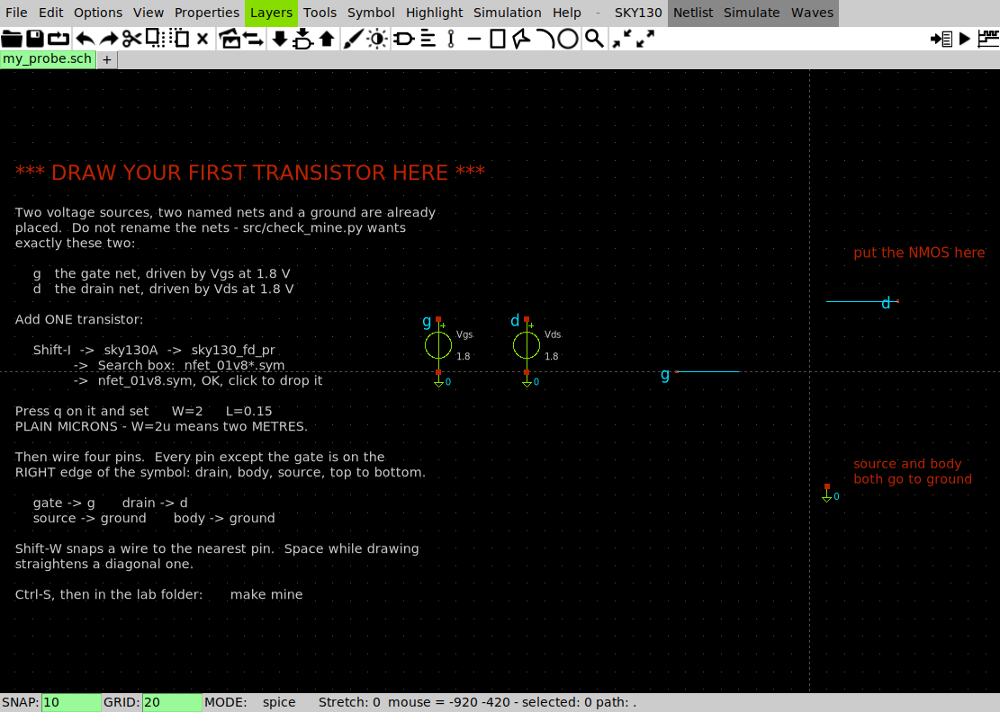

# Lab 01 — Your first schematic

Full runnable package:
[`labs/lab-01-first-schematic/`](https://github.com/uoftasic/ad103/tree/main/labs/lab-01-first-schematic).

You will draw one transistor in XSchem, watch it become six lines of SPICE, and get a current
out of it. Then you will break the same circuit twice on purpose — once so loudly that ngspice
refuses to run, and once so quietly that it hands you an answer that is wrong by a factor of
6821.

That second one is the whole reason this lab exists.

## Prerequisites

- [Getting started](guide/getting-started.md) read through §11, so that `echo $PDK` says
  `sky130A` and XSchem's menu bar says **SKY130**
- Nothing else. This lab runs in a bare container with **no environment setup at all** — the
  `Makefile` pins `PDK=sky130A` itself. If your environment setup went badly, run `make`
  anyway; it is the fastest way to find out whether the problem is yours or the toolchain's.

## Objectives

- Place a `sky130_fd_pr__nfet_01v8`, set its $W$ and $L$, and wire its **four** pins
- Read a netlist and check it against the drawing you think you made
- Get a real number out of a real device model — and know why it is negative in the log
- Cause `could not find a valid modelname` deliberately, so you recognise it later
- Cause a **silent** wiring failure deliberately, and learn the one-line check that catches it

## Theory (there isn't much)

A MOSFET at $V_{GS} = V_{DS} = V_{DD}$ is as far on as it goes. Everything else in this course
is about what happens between there and off. For now the only claim being made is that the
chain works:

$$\text{schematic} \;\longrightarrow\; \text{netlist} \;\longrightarrow\; \text{ngspice}
\;\longrightarrow\; \text{a number}$$

and the number for $W$ = 1 µm, $L$ = 0.15 µm is **501.046 µA**.

## Procedure

```bash
cd labs/lab-01-first-schematic
make
```

About **2.5 seconds**, and it ends in a verdict. Then the four other targets, in this order:

| Target | What it does | Time |
|---|---|---|
| `make` | netlist the reference schematic, simulate, verdict | ~2.5 s |
| `make edit` | open **your** schematic in XSchem | — |
| `make mine` | netlist and grade your schematic, then simulate it | ~3 s |
| `make wrong-units` | `W=1u` instead of `W=1` — **fails loudly** | ~2 s |
| `make unconnected` | one wire one grid step short — **does not fail** | ~3 s |
| `make bins` | which model bin your device landed in, and what `leff` really is | ~2 s |

### Step 1 — prove the toolchain, before you trust anything else

```
== checking
  device line : XM1 d g 0 0 sky130_fd_pr__nfet_01v8 L=0.15 W=1 nf=1 ad=0.29 as=0.29 pd=2.58 ps=2.58 nrd=0.29 nrs=0.29 sa=0 sb=0 sd=0 mult=1
  drain current : 501.046 uA  (reference 501.046 uA)

PASS  netlist and operating point match the reference run
```

- **Try this:** read the device line before the current. Four node names — `d g 0 0` — in the
  order **drain, gate, source, body**. Then look at `xschem/nmos_probe.sch` and find each one
  on the drawing.
- **What you should see:** `501.046 uA`, and `i(vds) = -5.01046e-04` in `results/nmos_op.log`.
  The sign is negative because ngspice reports current flowing *into* the positive terminal of
  a source, and this source is pushing it out.
- **Why an engineer cares:** this is your control. From here on, when a page in this course
  disagrees with your screen, `make` in this folder settles which of you is wrong in two and a
  half seconds.

### Step 2 — draw one yourself

```bash
make edit
```



*Everything but the transistor is placed and wired. `Vgs` and `Vds` are 1.8 V, connected by net
name rather than by wire — two `lab_pin`s with the same label are the same net, wherever they
sit on the page. The status bar reads `SNAP: 10  GRID: 20  MODE: spice`; snap is why your wires
can land exactly on pins instead of near them.*

Add one `nfet_01v8` with **`W=2`** and **`L=0.15`**, wire its four pins, `Ctrl-S`, and:

```bash
make mine
```

- **Try this:** before you run it, predict the current. The reference device is $W$ = 1 µm and
  draws 501.046 µA. Yours is twice as wide. Write your number down.
- **What you should see:**

```
  YOUR TRANSISTOR
    W = 2 um, L = 0.15 um, V_GS = V_DS = 1.8 V
    drain current    1030.4200 uA
    reference        1030.4224 uA
```

  Twice 500.941 — the reference current *as the XSchem netlist produces it* — is 1001.882.
  You measured **1030.42**, which is **2.85 % more**. Doubling the width bought slightly more
  than double the current.
- **Why an engineer cares:** 2.85 % is too small to be a mistake and too large to be noise. It
  is the first crack in "current is proportional to $W$", and [Lab 04 — $W/L$ is a
  knob](labs/lab-04-wl-knob-overview.md) is entirely about what is behind it.

> **Two numbers, both correct, 0.02 % apart.** The hand-written deck gives 501.046 µA and the
> XSchem netlist gives 500.941 µA for the same device. The symbol computes the source and drain
> diffusion areas and resistances from $W$ and writes them onto the device line; the hand deck
> leaves them at zero. That difference is the layout showing up in an electrical answer for the
> first time in this course, and it is the smallest it will ever be.

### Step 3 — the loud failure

```bash
make wrong-units
```

```
Error on line 13 or its substitute:
  m.xm1.msky130_fd_pr__nfet_01v8 d g 0 0 xm1:sky130_fd_pr__nfet_01v8__model l=    1.500000000000000e-07     w=    1.000000000000000e-06 ...
could not find a valid modelname
    Simulation interrupted due to error!
```

- **Try this:** run it, then `diff spice/nmos_op.spice spice/nmos_op_wrong_units.spice`.
- **What you should see:** two characters. `L=0.15u W=1u` instead of `L=0.15 W=1`.
- **Why an engineer cares:** SKY130's models are **binned** — each `.model` card covers a range
  of widths and lengths, written in microns. A width of `1e-06`, which is what `1u` means in
  SPICE, is one metre and falls outside every bin, so no model matches and ngspice stops. The
  message names neither `W` nor units, which is why the reflex is *"check `W` and `L` first"*
  rather than *"read the error"*.

### Step 4 — the quiet one, which is worse

```bash
make unconnected
```

```
   XSchem exit status: 0.  No error, no warning.  Here is the device line:
     XM1 d net1 0 0 sky130_fd_pr__nfet_01v8 L=0.15 W=1 nf=1 ...

     Note: Starting dynamic gmin stepping
     Warning: Dynamic gmin stepping failed
     Note: Starting true gmin stepping
     Warning: True gmin stepping failed
     Note: Starting source stepping
     Warning: source stepping failed
     Note: Transient op started
     Note: Transient op finished successfully
     i(vds) = -7.34593e-08
     v(net1) = 5.017472e-01
```

- **Try this:** open `xschem/broken_probe.sch` next to `xschem/nmos_probe.sch` and find the
  difference. It is one wire, ending 20 units short of the gate pin — about a millimetre on
  screen.
- **What you should see:** **73.4593 nA** where the working circuit gives 501.046 µA. Wrong by
  a factor of **6821**, with no error anywhere. `v(net1) = 0.5017472 V` is the gate, floating,
  settling wherever the solver left it — `Vgs` is still in the circuit, still set to 1.8 V, and
  no longer connected to anything that matters.
- **Why an engineer cares:** the only warning you get is three lines of solver grumbling that
  look exactly like the noise you learn to scroll past. XSchem invents a name like `net1` for
  every pin connected to nothing, and it does it silently, and those invented names are
  therefore the fingerprint of the mistake:

```bash
grep 'net[0-9]' xschem/simulation/*.spice
```

  **Run that after every netlist for the rest of this course.** Any hit is a wire you believe is
  connected and is not. It is faster and far more reliable than squinting at the canvas, and it
  finds nine of ten wiring mistakes before they cost you an evening.

## Expected results

```
PASS  netlist and operating point match the reference run
```

from `make`, and

```
PASS  you drew a transistor, XSchem turned it into SPICE, and ngspice
      answered 1030.4200 uA.
```

from `make mine`. If `make mine` says `FAIL`, it names which of the five things went wrong — a
missing device, a unit suffix on `W`, a `net7` where a wire did not land, the source on the
wrong node, the body left floating — and what to do about each.

## Scary but normal

Run any deck in this course by hand and the first eight lines are these:

```
Error opening osdi lib "/foss/pdks/sky130A/libs.tech/ngspice/osdi/psp103.osdi": No such file or directory!
Error: Library /foss/pdks/sky130A/libs.tech/ngspice/osdi/psp103.osdi couldn't be loaded!
...
Warning: OSDI libs have not been loaded successfully.
    Any of the following steps may fail, if Verilog A models are involved!.
```

**Four `Error:` lines, before your circuit is even read, on a run that then works perfectly.**
OSDI is ngspice's plug-in interface for Verilog-A compiled models. SKY130's `nfet_01v8`,
`pfet_01v8` and diodes are all built-in BSIM and diode models, so nothing this course does
needs any of those four libraries. The `Makefile` sends this to a log so you normally never see
it; you will the first time you type `ngspice -b` yourself.

Two more that are also normal:

```
Warning: Eta0 = -0.0310679 is negative.
Note: No compatibility mode selected!
```

The first is SkyWater's model card having a negative fitting parameter, which BSIM allows and
mentions. The second is ngspice saying it is not pretending to be HSPICE.

**The rule for telling these from a real problem:** a real failure says `Error on line …` and
is followed by `Simulation interrupted due to error!` and then `no simulations run!`. If you
see numbers after the warnings, the warnings were scenery.

## Links

- [Lab package](https://github.com/uoftasic/ad103/tree/main/labs/lab-01-first-schematic)
- Guide: [Getting started](guide/getting-started.md) ·
  [XSchem cheat sheet](reference/xschem-cheatsheet.md) ·
  [When ngspice complains](reference/ngspice-errors.md)
- Next lab: [Lab 02 — The diode I–V curve](labs/lab-02-diode-iv-overview.md)
