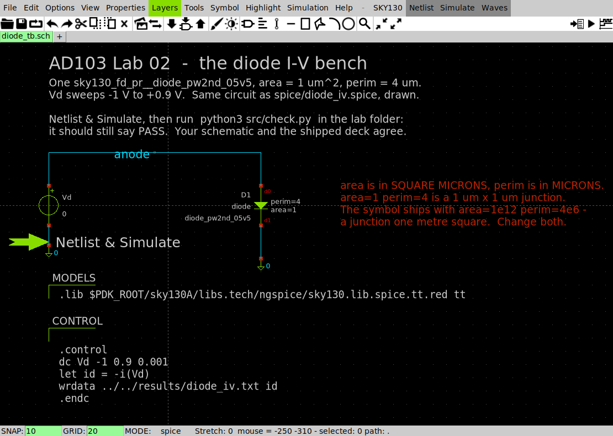
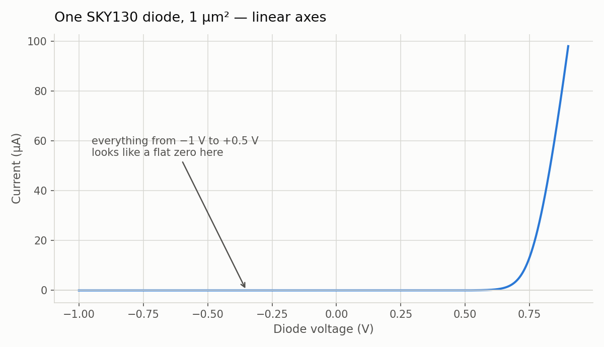
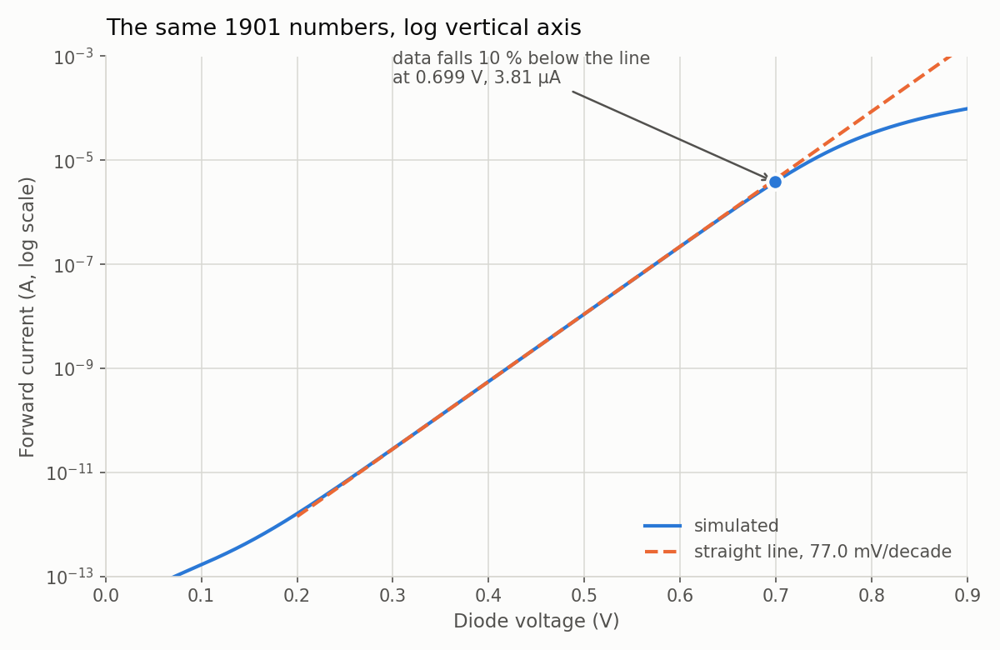
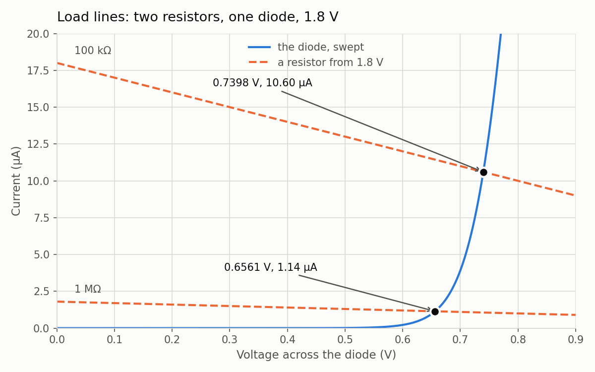
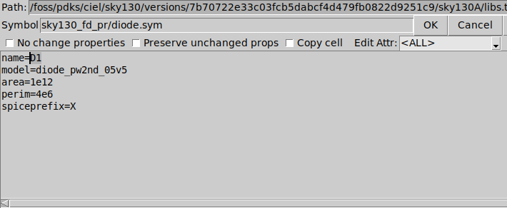

# Lab 02 — The diode I–V curve

Full runnable package:
[`labs/lab-02-diode-iv/`](https://github.com/uoftasic/ad103/tree/main/labs/lab-02-diode-iv).

You will sweep one real SKY130 diode through nine decades of current, prove to yourself that
superposition has stopped working, and pull two of SkyWater's own model parameters back out of
the shape of your own graph.

## Prerequisites

- [Getting started](guide/getting-started.md) and [Lab 01 — Your first
  schematic](labs/lab-01-first-schematic-overview.md) complete — `make` in
  `labs/lab-01-first-schematic` prints `PASS` and **501.046 µA**
- Read Movements I and II: [The straight line runs
  out](guide/the-straight-line-runs-out.md) → [The operating
  point](guide/the-operating-point.md) → [A diode is an
  exponential](guide/the-diode-is-an-exponential.md) → [Three models of one
  diode](guide/three-models-of-one-diode.md)

Nothing else. This lab runs in a bare container with **no environment setup at all** — no
`.designinit`, no `mod`, no `PDK` variable. The decks find the models through `PDK_ROOT`, which
the image already sets to `/foss/pdks`, and the `Makefile` pins it anyway. The XSchem bench in
`xschem/` needs `PDK=sky130A` to find its symbol libraries, so `xschem/xschemrc` sets that for
itself rather than trusting the environment — the image's own default is the IHP process, and
on it this bench netlists to `D1 - diode IS MISSING !!!!`, simulates without a single error,
and writes a column of zeros. If your Getting-started environment is half-broken, this lab
still works, and that is deliberate.

## Objectives

- Measure the I–V curve of a `sky130_fd_pr__diode_pw2nd_05v5` and read it on both linear and
  log axes
- Demonstrate, with numbers, that a diode violates superposition by a factor of 15,618
- Extract the **ideality factor** and the **series resistance** from your own data and check
  both against SkyWater's model card
- Tell the difference between a feature of the device and a setting of the simulator
- Recognise three ways of writing a diode's size that ngspice accepts without complaint and
  that are wrong

## Theory (short)

$$
I \;=\; I_0\left(e^{\,V/nV_T}-1\right),
\qquad V_T=\frac{kT}{q}=25.8649\ \text{mV at }27\,^\circ\text{C}
$$

$$
\text{one decade of current} \;=\; nV_T\ln 10
\;=\;n \times 59.556\ \text{mV}
$$

Everything on the guide pages reduces to those two lines. The lab measures the left-hand sides
and solves for $n$ and $I_0$.

## Procedure

```bash
cd labs/lab-02-diode-iv
make
```

That is the whole required procedure — about **six seconds**. It runs the DC sweep, runs the
additivity test, draws three plots, and prints a verdict.

| Target | What it does | Time |
|---|---|---|
| `make` | sweep + additivity + plots + verdict | 5–7 s |
| `make area` | what junction size buys you, and three silent unit traps | ~2 s |
| `make floor` | what the flat reverse line on the log plot really is | ~2 s |
| `make op` | a resistor and a diode in series, three times | ~2 s |
| `make broken` | hands the checker a deliberately wrong sweep | <1 s |
| `make clean` | delete `results/` | — |

Those wall times are **ballpark** — they move with your machine. Every other number on this
page is **golden**: same image, same deck, same digits, and the checker enforces it.

### The bench you are simulating

`labs/lab-02-diode-iv/xschem/diode_tb.sch` is the same circuit as `spice/diode_iv.spice`, drawn:



*One `sky130_fd_pr__diode_pw2nd_05v5` with `area=1` and `perim=4`, a source `Vd` sweeping −1 V to
+0.9 V, and the two text blocks that carry the `.lib` line and the `.control` block. Everything
the deck says, said in pictures.*

## Expected results

`make` prints 81 lines. The checker enforces currents to 1 %, voltages to 1 mV, and the slope
to 0.5 %.

```
== DC sweep: 1901 points, -1.000 V to +0.900 V
   (about 2 s, model library included)
   wrote results/diode_iv.txt
== additivity test: a resistor and a diode, driven three ways
--- 100 kohm resistor (amps) ---
    A alone, B alone, then A+B predicted by superposition, then measured
i_r_a = 3.500000e-06
i_r_b = 3.500000e-06
i_r_sum = 7.000000e-06
i_r_ab = 7.000000e-06
--- 1 um^2 diode (amps) ---
    A alone, B alone, then A+B predicted by superposition, then measured
i_d_a = 1.254090e-10
i_d_b = 1.254090e-10
i_d_sum = 2.508180e-10
i_d_ab = 3.917437e-06
== plots
  rows read          : 1901
  reverse at -1.000 V: -1.0036 pA

  current      forward V     mV since previous decade
     1e-12 A   0.181962 V           -
     1e-11 A   0.264643 V       82.68
     1e-10 A   0.342408 V       77.77
     1e-09 A   0.419503 V       77.09
     1e-08 A   0.496518 V       77.02
     1e-07 A   0.573602 V       77.08
     1e-06 A   0.651480 V       77.88

  fit over 154 points from 1e-09 A to 1e-07 A:
    slope           : 77.037 mV/decade
    thermal voltage : 25.8649 mV  (27 degC)
    ideality n      : 1.2935
    I0 (V=0 intercept): 3.5864 fA
    leaves the line : 0.699 V, 3.8136 uA (line says 4.2487 uA)

  series resistance, from the top of the curve:
    at 0.900 V the diode carries 98.0354 uA
    the straight line needs only 0.804011 V for that current
    so 95.989 mV is dropped outside the junction
    rs = 95.989 mV / 98.0354 uA = 979.1 ohm

  local slope, measured over a 20 mV window:
     V        I(A)         mV/decade
   0.050  6.2317e-14       96.11
   0.100  1.6726e-13      123.18
   0.150  4.6233e-13      101.91
   0.200  1.6055e-12       85.75
   0.250  6.5318e-12       79.61
   0.300  2.8333e-11       77.72
   0.350  1.2541e-10       77.19
   0.400  5.5825e-10       77.05
   0.450  2.4887e-09       77.01
   0.500  1.1097e-08       77.02
   0.550  4.9442e-08       77.11
   0.600  2.1945e-07       77.50
   0.650  9.5789e-07       79.19
   0.700  3.9174e-06       85.92
   0.750  1.3278e-05      107.03
   0.800  3.3105e-05      151.64
   0.850  6.2443e-05      217.80

  wrote results/ad103-diode-iv-linear.png
  wrote results/ad103-diode-iv-log.png
  wrote results/ad103-diode-load-line.png
== checking
  I(0.450 V) = 2.488707e-09 A   (reference 2.488707e-09)
  I(0.600 V) = 2.194466e-07 A   (reference 2.194466e-07)
  I(0.700 V) = 3.917437e-06 A   (reference 3.917437e-06)
  I(-1.000 V) = -1.0036 pA  (reference -1.0036 pA)
  V at 1e-09 A = 0.419503 V   (reference 0.419503)
  V at 1e-08 A = 0.496518 V   (reference 0.496518)
  V at 1e-07 A = 0.573602 V   (reference 0.573602)
  slope       = 77.0367 mV/decade over 154 points (reference 77.0367)
  ideality n  = 1.29351          (reference 1.29351; sky130's model card says 1.2928)
  I0          = 3.5864 fA        (reference 3.5864 fA)
  leaves the straight line at 0.699 V, 3.8136 uA
  resistor: superposition off by 0.0000 %
  diode   : superposition off by a factor of 15,618.6

PASS  every number matches the reference run
```

**Scary-but-normal output, so you do not have to wonder.** The `results/*.log` files each open
with

```
Warning: sky130_fd_pr__diode_pw2nd_05v5: IKR too small - model effect disabled!
```

on **every single run**, including the runs that produce the numbers above. It is SkyWater's
model card setting a high-injection parameter to zero, and ngspice telling you it has therefore
switched that effect off. Nothing is wrong. A real problem in an ngspice log starts with
`Error:` at the beginning of a line — `grep -c '^Error' results/*.log` should be `0` everywhere.

## The three figures

### F1 — linear axes



- **Try this:** find the point on this plot where the current is 1 nA.
- **What you should see:** you cannot. 1 nA is 0.001 % of the top of the axis. The sweep says it
  happens at **0.419503 V**, which on this plot is somewhere in the flat part.
- **Why an engineer cares:** most analog circuits live in the part of this plot that linear axes
  cannot draw. Choosing the wrong axis can hide the entire operating range of your device.

### F2 — log axes



- **Try this:** put a ruler on the straight part and read off two points a decade apart. Then
  compare with the `mV since previous decade` column.
- **What you should see:** 77 mV per decade, everywhere between about 0.30 V and 0.65 V. The
  four middle rows of the decade table agree to better than 1 %.
- **Why an engineer cares:** $77.037 / 59.556 = 1.2935$ is the **ideality factor**, and SkyWater
  wrote `n = 1.2928` on the model card. You just extracted a foundry parameter from a graph.

### F3 — load lines



- **Try this:** run `make op` and check the two marked crossings against `v(n2)` and `v(n3)`.
- **What you should see:** `0.7398473` and `0.6561163`, matching the plot's `0.7398 V` and
  `0.6561 V`. The plot was drawn from the sweep; the numbers came from a nonlinear solve of a
  different circuit.
- **Why an engineer cares:** this is what "bias point" means, concretely, and it is the first
  step in designing anything analog.

## Read a FAIL you caused on purpose

```bash
make broken
```

`src/bend_it.py` copies your sweep and multiplies every current by exactly 1.05 — a 5 % error,
which is far too small to see on either plot.

```
== feeding the checker a sweep that is 5 % off, on purpose
  wrote results/diode_iv_bent.txt (every current multiplied by 1.05)
...
FAIL
  - I(0.450 V) is 2.613143e-09 A, reference is 2.488707e-09 A - off by +5.00 %
  - I(0.600 V) is 2.304189e-07 A, reference is 2.194466e-07 A - off by +5.00 %
  - I(0.700 V) is 4.113309e-06 A, reference is 3.917437e-06 A - off by +5.00 %
  - reverse current -1.0537 pA is not the reference -1.0036 pA
  - V at 1e-09 A is 0.417871 V, reference is 0.419503 V
  - V at 1e-08 A is 0.494886 V, reference is 0.496518 V
  - V at 1e-07 A is 0.571966 V, reference is 0.573602 V
  - I0 is 3.7644 fA, reference is 3.5864 fA - the whole curve is scaled wrong, which usually means the junction is not the size you think it is
```

Read what **did not** fail. The slope is still `77.0349` against a reference of `77.0367`, and
$n$ is still `1.29348`. **A 5 % scaling error does not change the slope of a log plot at all** —
it slides the whole line sideways by $77.04 \times \log_{10}(1.05) = 1.63$ mV, which is exactly
the shift you can see in the three decade voltages.

That is the diagnostic habit this lab is really teaching: **on a log-current plot, the slope
tells you about $n$ and the offset tells you about $I_0$, and they fail independently.** A wrong
slope means the physics is wrong. A wrong offset with a right slope means the *size* is wrong —
wrong `area`, wrong `perim`, wrong number of devices in parallel.

## Three ways to get the size wrong, all silent

```bash
make area
```

```
--- Part 2: three lines that all mean to say 1 um^2, at 0.700 V (amps) ---
    correct, then perim misspelled as pj, then symbol defaults
i_b1um = 3.917437e-06
i_pj = 2.571530e-04
i_def = 2.291258e+06
--- and area=1u, which means a millionth of a square micron (amps) ---
i_su = 4.541414e-12
```

Four device lines, all intended to be a 1 µm² junction. **ngspice printed no error for any of
them.**

| What you wrote | What you got at 0.700 V | Why |
|---|---|---|
| `area=1 perim=4` | **3.917437 µA** | correct |
| `area=1 pj=4` | 257.1530 µA, **66× too big** | `pj` is the raw model card's name for it. The subckt parameter is `perim`, so `pj=4` is an unknown parameter, silently ignored, and `perim` keeps its default of **1e6** — a junction one metre around. |
| *(no parameters at all)* | 2,291,258 A | the XSchem symbol's own defaults, `area=1e12 perim=4e6`: a junction **one metre square**. Two and a quarter **mega**amps. |
| `area=1u perim=4u` | 4.541414 pA | micron numbers carry **no unit suffix**, exactly as with `W` and `L` in Lab 01. `1u` is a millionth of a square micron. |



*Row three of that table, as you meet it: press <kbd>q</kbd> on a fresh `diode.sym` and this is
what the symbol ships with — `area=1e12`, `perim=4e6`. Change **both** before you netlist.*

The last row deserves a moment. In Lab 01 that same mistake stopped ngspice dead with
`could not find a valid modelname`, because MOSFET models are *binned* and a device in metres
falls outside every bin. Diodes are not binned. The identical error now produces a clean,
confident, completely wrong answer, and the only thing that catches it is you.

> **The reflex check:** after netlisting anything with a diode in it,
> `grep -n 'diode' <netlist> ` and read the `area=` and `perim=` on every line. Bare micron
> numbers, `perim` spelled out, no defaults left in place.

## The floor is the simulator, not the diode

```bash
make floor
```

```
--- default GMIN = 1e-12 S (amps; negative = current flowing backwards) ---
    at -1.000 V, at -0.500 V, at +0.100 V
i_m1v0 = -1.00356e-12
i_m0v5 = -5.03558e-13
i_p0v1 = 1.672571e-13
--- GMIN = 1e-15 S: the same diode, a thousand times less simulator ---
    at -1.000 V, at -0.500 V, at +0.100 V
j_m1v0 = -4.55885e-15
j_m0v5 = -4.05763e-15
j_p0v1 = 6.735706e-14
```

- **Try this:** subtract $\text{GMIN}\times V$ from each of the four reverse numbers.
- **What you should see:** **3.56, 3.558, 3.559, 3.558 fA** — the same constant four times, from
  two voltages and two simulator settings. Compare it with the `I0` your forward fit reported:
  **3.5864 fA**, from the opposite end of the curve.
- **Why an engineer cares:** if you had reported "this diode leaks 1 pA" you would have been
  reporting ngspice's default `gmin`, not silicon. Worked all the way through on [A diode is an
  exponential](guide/the-diode-is-an-exponential.md).

## When it goes wrong

| What you see | What it means |
|---|---|
| `Error: unknown subckt: xd1 a 0 sky130_fd_pr__diode_pw2nd_05v5 area=1 perim=4` followed by `Error: incomplete or empty netlist` | Two different causes, same message: either there is **no `.lib` line**, or the **model name is misspelled**. The error quotes your device line, not the cause. Check the `.lib` line first — it is the more common one. |
| `Warning: … IKR too small - model effect disabled!` | Normal. Every run. See above. |
| A current about 66× larger than the reference | `pj=` instead of `perim=`. |
| A current about **a million times** smaller than the reference (picoamps where you expected microamps) | a `u` on `area` or `perim`. |
| `make: ngspice: No such file or directory` | You are running on the host, not in the workbench container. This lab needs `hpretl/iic-osic-tools:2026.04`. |
| The checker says `no sweep data at …` | `make sweep` has not run, or `make clean` removed it. Just run `make`. |

More, with the full text of each: [When ngspice complains](reference/ngspice-errors.md).

## Going further

None of this is graded and all of it is quick.

1. **Change the temperature.** Add `.options temp=100` to `spice/diode_iv.spice` and re-run
   `make sweep plots`. Predict first: $V_T$ scales with absolute temperature, so 77.04 mV/decade
   should become about $77.04\times(373.15/300.15) = 95.8$ mV/decade. Then see how much of the
   change is $V_T$ and how much is $I_0$ — because $I_0$ moves too, and much harder. **The
   checker will FAIL, correctly**: you changed the experiment. Read which lines it objects to
   and which it does not.
2. **Sweep the other diode.** `sky130_fd_pr__diode_pd2nw_05v5` is the p-diffusion-into-n-well
   junction — the same idea built the other way up. Change the model name in the deck and see
   whether $n$ comes out the same.
3. **Two in series.** Put two 1 µm² diodes in series across the sweep source. Predict the
   decade slope before you run it.

## Links

- [Lab package](https://github.com/uoftasic/ad103/tree/main/labs/lab-02-diode-iv)
- Guide pages this lab belongs to: [The straight line runs
  out](guide/the-straight-line-runs-out.md), [The operating
  point](guide/the-operating-point.md), [A diode is an
  exponential](guide/the-diode-is-an-exponential.md), [Three models of one
  diode](guide/three-models-of-one-diode.md)
- Next lab: [Lab 03 — The regions of a MOSFET](labs/lab-03-mosfet-regions-overview.md)
- Stuck? [Team Discord](https://discord.gg/hrJnP5UsGz) — quote the exact line and say which
  `make` target you ran.
