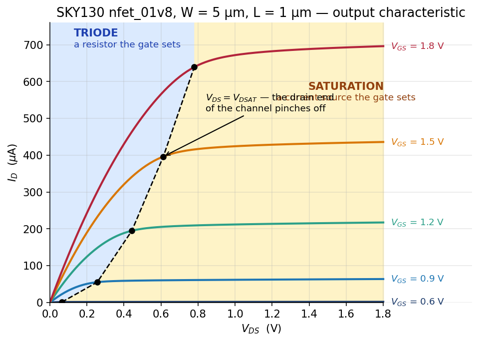
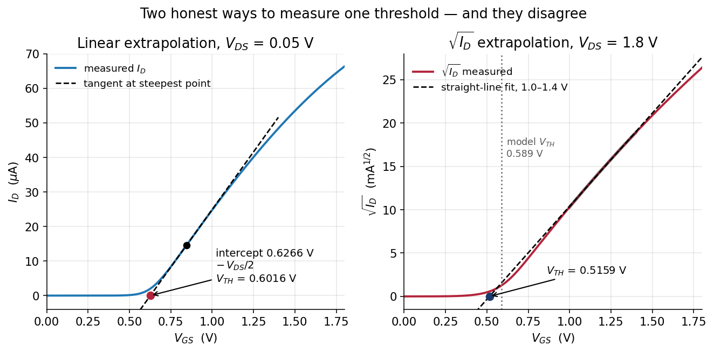
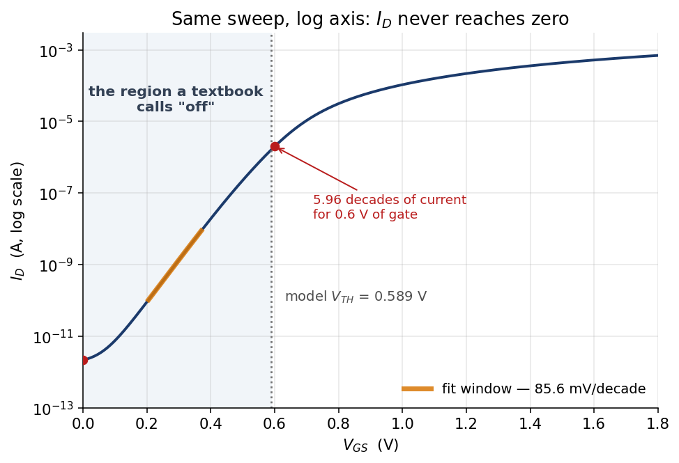
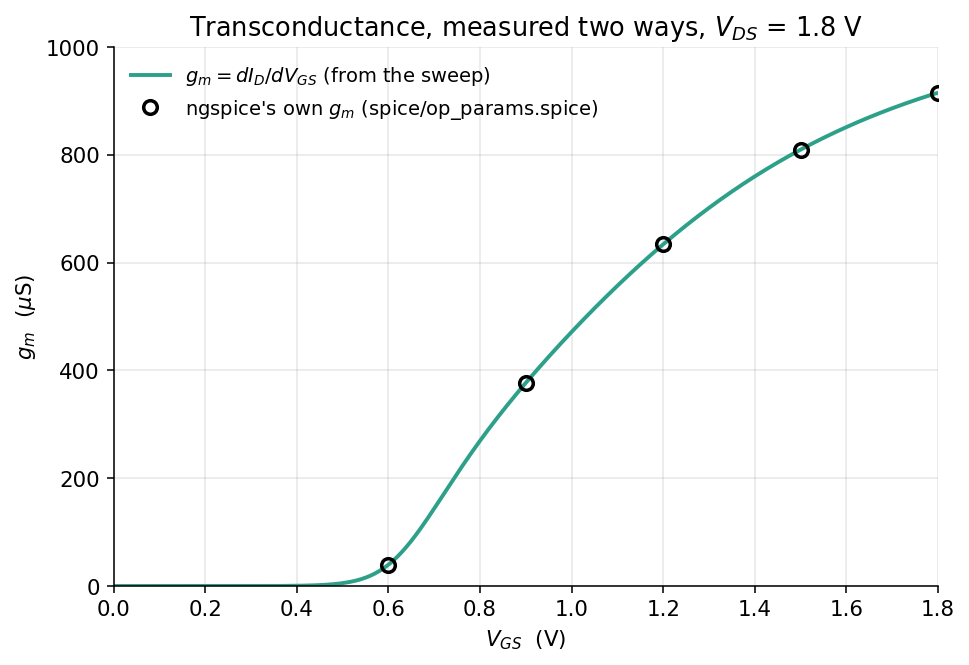
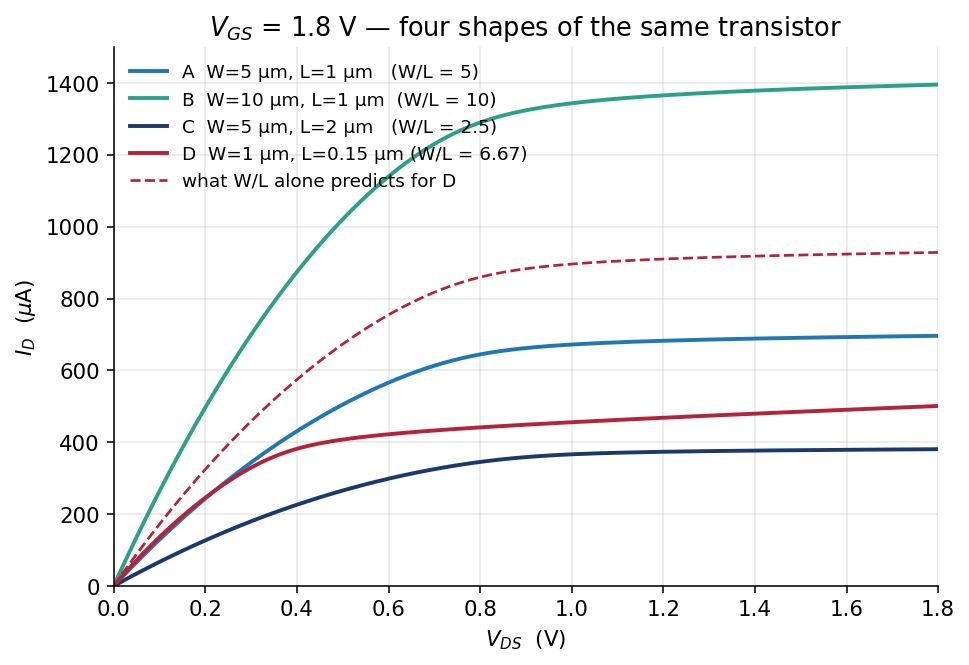
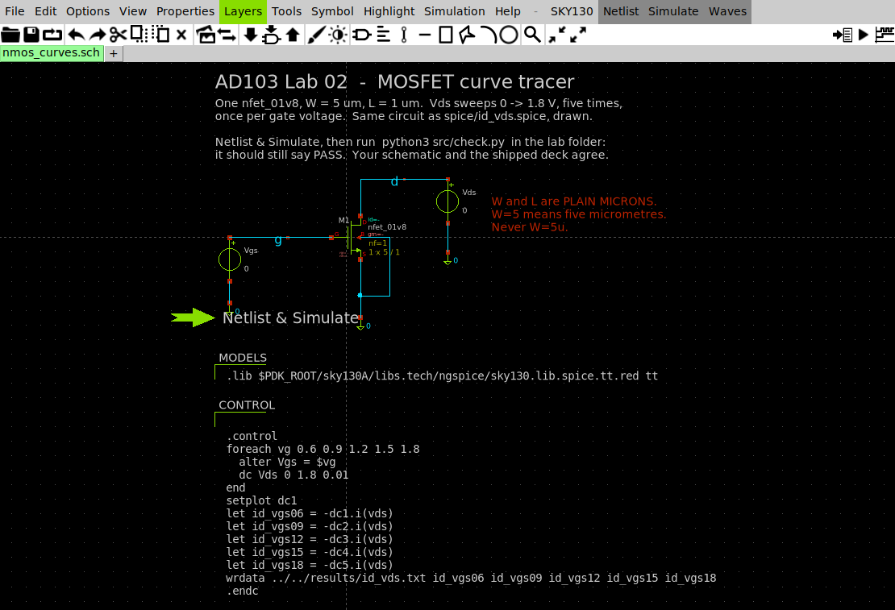

# Lab 03 — The regions of a MOSFET

Full runnable package:
[`labs/lab-03-mosfet-regions/`](https://github.com/uoftasic/ad103/tree/main/labs/lab-03-mosfet-regions).

## Prerequisites

- [Getting started](guide/getting-started.md) complete — `make` in
  `lab-01-first-schematic` prints `PASS` and **501.046 µA**
- [Lab 02 — The diode I–V curve](labs/lab-02-diode-iv-overview.md) done
- Read Movement III: [A MOSFET is a valve](guide/a-mosfet-is-a-valve.md) →
  [Four regions, not three](guide/four-regions-not-three.md) →
  [Where saturation starts](guide/where-saturation-starts.md)

## Objectives

- Sweep a real SKY130 `nfet_01v8` and identify cutoff, triode, saturation and
  subthreshold on your own measured curves
- Extract $V_{TH}$ two different ways from two different sweeps, and explain why
  the two answers differ by 86 mV
- Measure $g_m$ as the slope of a curve and check it against the simulator's own $g_m$
- Show that $I_D$ scales with $W$ but not with $1/L$, and name both reasons
- Read the exact ngspice error a unit suffix on `W` produces, on purpose, before
  you produce it by accident

## Theory (short)

$$
I_D^{\text{tri}} = \mu_n C_{ox}\frac{W}{L}\Big[(V_{GS}-V_{TH})V_{DS} - \tfrac{1}{2}V_{DS}^2\Big]
\qquad
I_D^{\text{sat}} = \tfrac{1}{2}\mu_n C_{ox}\frac{W}{L}(V_{GS}-V_{TH})^2
$$

with the boundary at $V_{DS} = V_{ov} = V_{GS} - V_{TH}$, and

$$
g_m = \frac{\partial I_D}{\partial V_{GS}}
\qquad
r_o = \left(\frac{\partial I_D}{\partial V_{DS}}\right)^{-1}
\qquad
S = \frac{\partial V_{GS}}{\partial (\log_{10} I_D)}\ \ \text{[mV/decade]}
$$

Below threshold the square law does not apply at all: $I_D$ is exponential in
$V_{GS}$, and $S$ is the number that describes it.

## Procedure

```bash
. /foss/designs/common/.designinit
echo $PDK                      # must say sky130A
mod ad103
cd labs/lab-03-mosfet-regions
make
```

**13–22 seconds** and it ends in a verdict. Then work through the four blocks:

```bash
make extract     # every parameter, with its working
make figures     # the six plots and the channel cross-sections
make vth-l       # vth at nine channel lengths
make wrong-units # the error you will otherwise meet at 1 a.m.
```

### Step 1 — the output characteristic



- **Try this:** run `make extract` and read the first block. Compare the `knee
  V_DS` column with $V_{GS} - V_{TH}$ using your own extracted $V_{TH}$ = 0.6016 V.
- **What you should see:** at $V_{GS}$ = 0.9 V the knee lands at **0.29 V** against a
  predicted 0.298 V — a hit. At 1.8 V it lands at **0.89 V** against a predicted
  1.198 V — 34 % out, in the same direction, every time.
- **Why an engineer cares:** the textbook boundary is a *long-channel, low-field*
  answer. Real saturation starts earlier because carriers hit a speed limit, and
  the model will tell you where if you ask it for `vdsat`.

### Step 2 — the transfer characteristic, and $V_{TH}$



- **Try this:** read the two `V_TH` blocks from `make extract`, then find
  `@m.xma...[vth]` in `results/op_params.log`.
- **What you should see:** **0.6016 V** by linear extrapolation, **0.5159 V** by
  $\sqrt{I_D}$ extrapolation, **0.5895 V** from the model. Three answers, one
  device, 86 mV of spread.
- **Why an engineer cares:** $V_{TH}$ is defined by its extraction method. A
  datasheet threshold with no method beside it has a tolerance you cannot see.

### Step 3 — the region your textbook deleted



- **Try this:** before running it, write down what you think $I_D$ is at $V_{GS}$
  = 0.30 V, half the threshold. Then read the `below threshold` block.
- **What you should see:** **1.3645 nA** — not zero, and part of a straight line
  **5.96 decades** tall with a slope of **85.6 mV/decade**.
- **Why an engineer cares:** ten million transistors at 2.1853 pA each is 21.9 µA
  of leakage; the same ten million with a threshold 0.3 V lower is **13.6 mA**.
  That factor of 624 is why threshold control is a whole discipline.

### Step 4 — $g_m$, twice



- **Try this:** the green curve is `numpy.gradient` on your sweep; the circles are
  what ngspice reports at five bias points. They are computed by completely
  different means.
- **What you should see:** at $V_{GS}$ = 1.8 V, **914.650 µS** from the slope
  against **915.312 µS** from the model — **0.07 %** apart. Also read the
  $g_m/I_D$ column: 5.90 /V at $V_{GS}$ = 0.9 V, falling to 1.31 /V at 1.8 V.
- **Why an engineer cares:** $g_m/I_D$ is transconductance per unit of current
  burned — efficiency. It is highest near threshold and worst wide open, which is
  exactly the opposite of where a beginner biases an amplifier.

### Step 5 — $W/L$



- **Try this:** predict the three currents from $W/L$ alone before you run it.
- **What you should see:** width is honest to **0.20 %**; doubling $L$ costs 9.4 %
  less current than $1/L$ predicts; and the minimum-length device delivers
  **501.046 µA** against a predicted 928.367 µA — **54 %**.
- **Why an engineer cares:** [W and L are a
  choice](guide/w-and-l-are-a-choice.md) closes that 54 % in two steps, and the
  two steps are the two reasons analog designers avoid minimum length.

### Step 6 — the trap, on purpose

```bash
make wrong-units
```

```
could not find a valid modelname
    Simulation interrupted due to error!
```

- **Try this:** run it, then `diff spice/id_vds.spice spice/id_vds_wrong_units.spice`.
- **What you should see:** two characters. `L=1u W=5u` instead of `L=1 W=5`.
- **Why an engineer cares:** SKY130's models are binned in microns, so a width in
  metres matches no bin and ngspice stops with a message that names neither `W`
  nor units. Reading a `FAIL` is a skill, and the best time to practise it is
  when you caused it on purpose.

## Expected results

`make` prints all eight and a verdict:

```
  YOUR NUMBERS
  ok  I_D  W=5 L=1, V_GS=V_DS=1.8 V        696.2755 uA      (reference 696.2750)
  ok  I_D  W=10 L=1, same bias            1395.3199 uA      (reference 1395.3200)
  ok  I_D  W=5 L=2, same bias              380.7284 uA      (reference 380.7280)
  ok  I_D  W=1 L=0.15, same bias           501.0462 uA      (reference 501.0460)
  ok  V_TH by linear extrapolation           0.6016 V       (reference 0.6016)
  ok  V_TH by sqrt(I_D) extrapolation        0.5159 V       (reference 0.5159)
  ok  g_m at V_GS = 1.8 V                  914.6500 uS      (reference 914.6500)
  ok  subthreshold slope                    85.5629 mV/dec  (reference 85.6000)

PASS  all eight extracted parameters match the reference run
```

If any line says `XX`, `check.py` tells you which and lists the three things that
actually cause it, in order of frequency.

## Draw it, if you want to



*`xschem/nmos_curves.sch` — the same circuit as `spice/id_vds.spice`, drawn. The
`.lib` line and the `.control` block ride along in two `code_shown` symbols, which
is how a testbench keeps its simulation commands next to its circuit.*

```bash
cd xschem
PDK=sky130A xschem nmos_curves.sch &
```

Press **Netlist & Simulate**, then `python3 src/check.py` from the lab folder. It
still says `PASS` — the schematic writes the same `results/id_vds.txt`. The drawn
device does draw **696.226 µA** rather than 696.275 µA, because the XSchem symbol
adds the diffusion resistances `nrd`/`nrs` that the hand deck omits. Fifty
nanoamps of layout, showing up in an electrical answer for the first time in this
course. The package README has the full device line.

## Links

- [Lab package](https://github.com/uoftasic/ad103/tree/main/labs/lab-03-mosfet-regions)
- [Reference answers to the three extensions](https://github.com/uoftasic/ad103/tree/main/labs/lab-03-mosfet-regions/solutions)
- Guide: [A MOSFET is a valve](guide/a-mosfet-is-a-valve.md) ·
  [Four regions, not three](guide/four-regions-not-three.md) ·
  [Where saturation starts](guide/where-saturation-starts.md) ·
  [W and L are a choice](guide/w-and-l-are-a-choice.md)
- Next lab: [Lab 04 — $W/L$ is a knob](labs/lab-04-wl-knob-overview.md)
