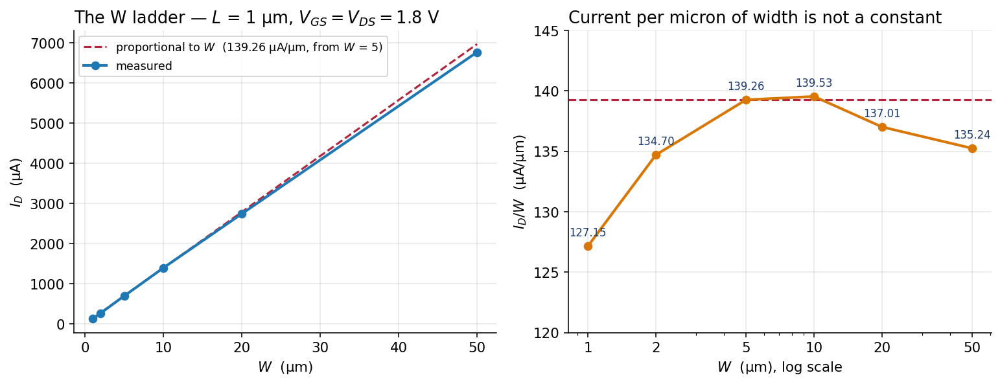
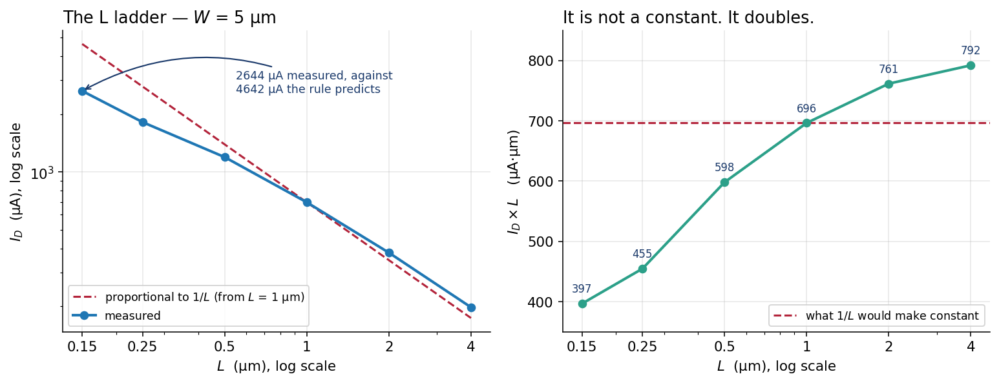
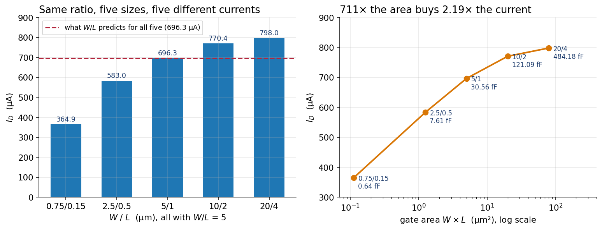

# Lab 04 — $W/L$ is a knob

Full runnable package:
[`labs/lab-04-wl-knob/`](https://github.com/uoftasic/ad103/tree/main/labs/lab-04-wl-knob).

Seventeen transistors, one bias point, and one rule under test. You write six predictions down
before you run anything. Two of them land. Four of them miss, by up to 91 %, and they miss in a
pattern you can read off the sign column.

The best of the four is this: **five devices whose $W/L$ is 5.000 in every case carry five
different currents**, spanning a factor of 2.19.

## Prerequisites

- [Lab 03 — The regions of a MOSFET](labs/lab-03-mosfet-regions-overview.md) done. This lab
  uses its reference device — $W$ = 5 µm, $L$ = 1 µm, **696.2755 µA** — as the anchor for every
  prediction
- Read Movement IV: [Threshold is not a constant](guide/threshold-is-not-a-constant.md) →
  [Transconductance and output resistance](guide/gm-and-ro.md) →
  [W and L are a choice](guide/w-and-l-are-a-choice.md)
- No environment setup. The `Makefile` pins `PDK=sky130A` itself

## Objectives

- Test "$I_D \propto W$" over a hundredfold range of width and find where it stops being true
- Test "$I_D \propto 1/L$" over a 27-fold range of length and find that it never quite was
- Show that two 5 µm transistors in parallel and one 10 µm transistor are **not the same
  device**, and that the first pair agrees with your prediction to every digit
- Find a device parameter that ngspice accepts, ignores, and never mentions
- Put a price on $W/L$ = 5: area, gate capacitance, and output resistance

## Theory (short)

$$
I_D^{\text{sat}} = \tfrac12\,\mu_n C_{ox}\frac{W}{L}\,(V_{GS}-V_{TH})^2
$$

$\mu_n$ and $C_{ox}$ belong to the foundry. $V_{GS}$ belongs to the rest of the circuit. $W$
and $L$ are the two numbers you type, and the equation says only their **ratio** matters.

This lab is an experiment on that last clause.

## Procedure

**Before anything else**, open `predictions.txt` and fill in the six blanks. It takes ninety
seconds, and it is the only part of this lab you cannot get back afterwards.

```bash
cd labs/lab-04-wl-knob
make            # about 9 s, ends in a verdict
make predict    # scores what you wrote
make extract    # the four blocks, with the working shown
make figures    # the three PNGs on this page
```

| Target | What it does | Time |
|---|---|---|
| `make` | four ngspice runs, then check ten numbers | ~9 s |
| `make predict` | your six guesses next to the rule and the measurement | <1 s |
| `make extract` | every number this lab teaches, with its arithmetic | <1 s |
| `make figures` | redraw the three figures into `results/` | ~3 s |
| `make broken` | hands the checker a run that is 3 % wrong — **fails on purpose** | <1 s |

Wall times are **ballpark**. Every other number on this page is golden and the checker enforces
it.

### Step 1 — score your predictions

```bash
make predict
```

```
  device            W/L    the W/L rule       measured       rule err   your guess    your err
  ------------------------------------------------------------------------------------------------
  W=10   L=1      10.00    1392.551 uA   1395.3200 uA     -0.2 %           --         --
  W=50   L=1      50.00    6962.755 uA   6762.1370 uA     +3.0 %           --         --
  W=5    L=2       2.50     348.138 uA    380.7284 uA     -8.6 %           --         --
  W=5    L=0.15   33.33    4641.837 uA   2644.1910 uA    +75.5 %           --         --
  W=0.75 L=0.15    5.00     696.275 uA    364.9284 uA    +90.8 %           --         --
  W=20   L=4       5.00     696.275 uA    798.0193 uA    -12.7 %           --         --
```

- **Try this:** cover the last two columns and read only `rule err`, top to bottom.
- **What you should see:** the two rows where you changed only $W$ are within 3 %. The four
  where you changed $L$ are out by 8 to 91 % — **positive every time you made $L$ shorter, and
  negative every time you made it longer.**
- **Why an engineer cares:** you now know which half of $W/L$ you may use in a hand
  calculation and which half you may not. That is a more useful thing to know than either the
  rule or its failure.

### Step 2 — width, over a hundredfold range



```
   W (um)      I_D           I_D / W        W x I(W=1)     model vth
   1         127.1470 uA  127.1470 uA/um     +0.00 %     615.2253 mV
   2         269.4032 uA  134.7016 uA/um     -5.61 %     603.4546 mV
   5         696.2755 uA  139.2551 uA/um     -8.69 %     589.4596 mV
   10       1395.3200 uA  139.5320 uA/um     -8.88 %     576.6242 mV
   20       2740.1490 uA  137.0075 uA/um     -7.20 %     564.0813 mV
   50       6762.1370 uA  135.2427 uA/um     -5.99 %     556.5815 mV
```

- **Try this:** on the left figure, the measured line and the prediction are almost on top of
  each other. Look at the right one instead, which is the same data divided by $W$.
- **What you should see:** current per micron of width is **not** a constant. It climbs 9.7 %
  from $W$ = 1 to $W$ = 10, then falls 3.1 % again by $W$ = 50 — a broad hump. The model's
  `vth` falls monotonically across the whole ladder, by 58.6438 mV.
- **Why an engineer cares:** the direction is honest — a wider device has a lower threshold, so
  it turns on harder — but a monotonic cause cannot on its own produce a non-monotonic effect.
  Something else is moving the other way past $W$ = 10 µm and this course does not claim to
  know what. What you can take away is the size: over a hundredfold range of width, "current is
  proportional to $W$" is wrong by less than 10 %. Use it.

### Step 3 — three ways to build "twice as wide", and two of them lie

```
   A   W=5            696.2755 uA   1.0000 x A   the reference
   B   W=10          1395.3200 uA   2.0040 x A   drawn twice as wide
   C   W=5 + W=5     1392.5510 uA   2.0000 x A   two of A, wired in parallel
   D   W=5 m=2       1392.5510 uA   2.0000 x A   ngspice's own multiplier
   E   W=5 mult=2     696.2755 uA   1.0000 x A   the subckt's 'multiplier'
   F   W=10 nf=2     1458.1360 uA   2.0942 x A   folded into two fingers

   A doubled by hand    1392.5510 uA
```

- **Try this:** compare C and D against the last line, digit by digit.
- **What you should see:** **1392.5510 against 1392.5510.** Two 5 µm transistors in parallel
  carry exactly twice one of them, and so does `m=2`. Your prediction was not approximately
  right; it was right.
- **Why an engineer cares — three separate reasons, and this is the densest block in the lab:**

  **B is not two of A.** One 10 µm device carries 2.7690 µA more than two 5 µm ones,
  +0.199 %. The model reports `vth` = 589.4596 mV for the 5 µm device and 576.6242 mV for the
  10 µm one — 12.8354 mV apart, at identical bias and identical length. Width is inside the
  model, not merely a multiplier in front of it. *"Twice as wide" and "two of them" are
  different circuits.*

  **E is a silent lie.** The sky130 subcircuit declares a parameter called `mult` and then
  never uses it — you can read that in
  `/foss/pdks/sky130A/libs.tech/ngspice/sky130.lib.spice.tt.red`, where the `.subckt` line
  lists `mult = 1` and the device line inside carries no `m = {mult}`. So `mult=2` in a
  hand-written deck is accepted, ignored, and never mentioned. `m=2` is the one that works.
  XSchem's symbol writes **both** — look at any netlist from Lab 01 and you will find
  `mult=1 m=1` on the device line — which is why the schematic route gets this right and
  copying a device line by hand does not.

  **F is not in $W/L$ at all.** `nf=2` folds one 10 µm channel into two 5 µm fingers that share
  a drain diffusion. Same $W$, same $L$, same bias, **+4.50 %**. That is a fact about the
  layout, and AD104 is where you draw it.

> **A dead end, so you do not find it at midnight.** Do not push `nf` higher to see how far the
> effect goes. `W=10 nf=5` aborts the entire run with
> `Fatal: Drout = -1.76308 is negative` and
> `doAnalyses: no such parameter on this device or parameter is missing` — a BSIM parameter
> check failing inside a model bin, not a mistake you made. Two fingers is the demonstration.

### Step 4 — length, which was never a clean $1/L$



```
   L (um)      I_D         I_D x L      vs 1/L from L=1   vth      vdsat
   0.15     2644.1910 uA   396.6287        +75.55 %     707.44   351.92 mV
   0.25     1818.6050 uA   454.6513        +53.14 %     658.63   426.29 mV
   0.5      1196.0170 uA   598.0085        +16.43 %     626.23   628.45 mV
   1         696.2755 uA   696.2755         +0.00 %     589.46   779.46 mV
   2         380.7284 uA   761.4568         -8.56 %     549.52   912.45 mV
   4         197.9738 uA   791.8952        -12.07 %     536.41  1001.27 mV
```

- **Try this:** the $I_D \times L$ column is the test. If $1/L$ were the law, it would be one
  number six times.
- **What you should see:** it runs from **396.63 to 791.90 — it doubles.** And `vdsat`, the
  model's own opinion of where saturation begins, runs from 351.92 mV to 1001.27 mV over the
  same ladder, against overdrives of 1092.6 mV and 1263.6 mV.
- **Why an engineer cares:** the 0.15 µm device stopped responding to its drain at a third of
  the overdrive the square law assumed it would use. That is velocity saturation, and it is why
  $1/L$ over-promises on every short device.

**Now close the gap, one effect at a time.** `make extract` does the arithmetic:

```
   Closing the L = 0.15 um gap, one effect at a time:
     1/L alone                                   4641.837 uA
     1/L, with each device's own vth and (V_ov)^2  3781.114 uA
     measured                                    2644.191 uA
   The threshold step closes 43.1 % of the gap.
```

- **Why an engineer cares:** the threshold step is real, it is measurable, and it closes **less
  than half**. No further arithmetic on `vth` reaches the rest, because the square law has no
  term for a carrier speed limit. **This is where hand calculation stops and the simulator
  starts**, and knowing exactly where that line falls is worth more than either tool alone.

### Step 5 — five devices, one ratio, five currents



```
   W / L        I_D          gate area      cgg        I_D per um^2
    0.75 / 0.15   364.9284 uA    0.1125 um^2     0.6427 fF    3243.81 uA/um^2
     2.5 / 0.5    582.9524 uA    1.2500 um^2     7.6137 fF     466.36 uA/um^2
       5 / 1      696.2755 uA    5.0000 um^2    30.5632 fF     139.26 uA/um^2
      10 / 2      770.4110 uA   20.0000 um^2   121.0871 fF      38.52 uA/um^2
      20 / 4      798.0193 uA   80.0000 um^2   484.1798 fF       9.98 uA/um^2
```

- **Try this:** check the ratio in the first column. 0.75/0.15 = 5. 20/4 = 5. Every row is 5.
- **What you should see:** **364.9284 µA to 798.0193 µA — a factor of 2.1868**, for identical
  $W/L$ at identical bias. The biggest device buys 2.19× the current of the smallest for
  **711× the gate area** and **753× the gate capacitance**. Per square micron of gate, the
  small one is **325× more efficient.**
- **Why an engineer cares:** area is money — a wafer costs what it costs and you are billed for
  the square millimetres you occupy — and gate capacitance is time, because whatever drives
  that gate has to charge it. So what does 711× the area actually buy? Read the same run's
  `gds`:

```
     gds(0.75/0.15) =   38.855 uS  ->  r_o =   25.74 kohm
     gds(20/4)      =    7.435 uS  ->  r_o =  134.50 kohm
```

  **5.23× the output resistance.** An amplifier's gain is $g_m r_o$, so that factor is the
  entire reason an analog designer pays for a long channel, and its absence is the entire
  reason a digital designer does not.

### Step 6 — read a FAIL you caused

```bash
make broken
```

It copies your own W ladder, moves the $W$ = 10 µm current by 3 %, and hands that to the
checker. Three percent is far too small to see by eye and quite large enough to be a wrong
device.

- **What you should see:** one `XX` row among nine `ok` rows, naming the number, both values
  and the percentage — then three causes in order of how often they happen, with a `grep` for
  the first one.
- **Why an engineer cares:** reading a `FAIL` is a skill, and the best time to practise it is
  when you already know the answer.

## Expected results

```
  YOUR NUMBERS
  ok  I_D  W=1  L=1                  127.1470 uA  (reference 127.1470)
  ok  I_D  W=5  L=1                  696.2755 uA  (reference 696.2755)
  ok  I_D  W=10 L=1                 1395.3200 uA  (reference 1395.3200)
  ok  I_D  W=50 L=1                 6762.1370 uA  (reference 6762.1370)
  ok  I_D  W=5  L=0.15              2644.1910 uA  (reference 2644.1910)
  ok  I_D  W=5  L=4                  197.9738 uA  (reference 197.9738)
  ok  I_D  W=0.75 L=0.15             364.9284 uA  (reference 364.9284)
  ok  I_D  W=20 L=4                  798.0193 uA  (reference 798.0193)
  ok  two W=5 in parallel           1392.5510 uA  (reference 1392.5510)
  ok  vth(W=10) - vth(W=5)           -12.8354 mV  (reference -12.8354)

  2 x I_D(W=5)           =    1392.5510 uA
  two W=5 in parallel    =    1392.5510 uA   (difference +0.000000 uA)

PASS  all ten measured values match the reference run
```

## Scary but normal

Every run leaves a three-line `bsim4v5.out` in the lab folder:

```
Checking parameters for BSIM 4.5 model xf:sky130_fd_pr__nfet_01v8__model.5
Warning: Eta0 = -0.0310679 is negative.
```

`spice/double_w.spice` writes it, and `xf` is the `nf=2` device. BSIM's parameter checker dumps
a file whenever a model card carries a value it wants to comment on, and SkyWater's
`nfet_01v8` bin 5 has a negative `Eta0`, which is legal and deliberate. The run is unaffected
and `make clean` removes it.

## Extensions

Three, with reference answers in
[`solutions/`](https://github.com/uoftasic/ad103/tree/main/labs/lab-04-wl-knob/solutions).
Predict, then run, then read — in that order.

1. Add `W=100` to the W ladder, then `W=200`. One of them tells you where the model ends, and
   the error it gives you is one you have already met for a completely different reason.
2. Build the same ladder out of `pfet_01v8`. At $L$ = 1 µm the NMOS carries **6.685×** the
   PMOS; the capstone measures the same ratio at $L$ = 0.15 µm and gets **2.496**. The ratio
   between the two device types is not a property of the process.
3. Re-run the L ladder at $V_{GS}$ = 0.9 V. If velocity saturation is really what breaks
   $1/L$, the short-channel error should shrink — and it does, from +75.5 % to +29.5 %. Then
   look at what happened to the long end.

## Links

- [Lab package](https://github.com/uoftasic/ad103/tree/main/labs/lab-04-wl-knob)
- [Reference answers](https://github.com/uoftasic/ad103/tree/main/labs/lab-04-wl-knob/solutions)
- Guide: [W and L are a choice](guide/w-and-l-are-a-choice.md) ·
  [Where saturation starts](guide/where-saturation-starts.md) ·
  [Transconductance and output resistance](guide/gm-and-ro.md)
- Next: [Capstone — The CMOS inverter](labs/capstone-inverter-overview.md)
