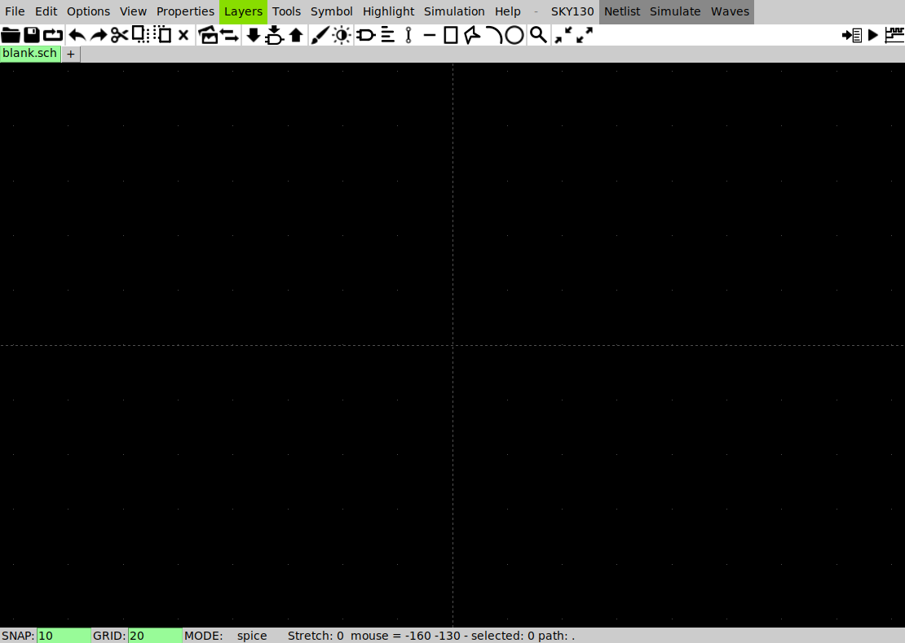
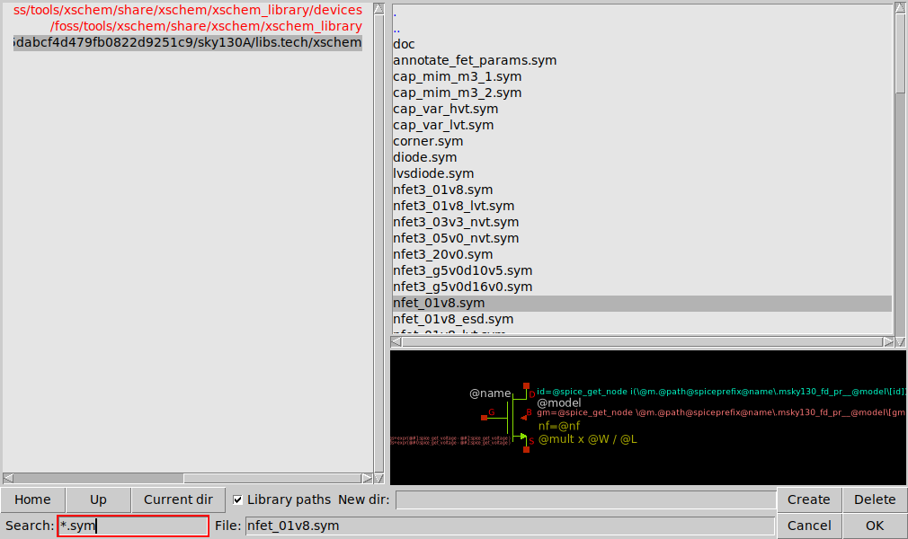

# XSchem cheat sheet

**Question this page answers:** *I have XSchem open. Which keys do I actually press?*

XSchem ships 154 key bindings and 16 mouse bindings — `keys.help` in the image lists them, and
they are all one keystroke, so there is no menu to hide behind. You will use eleven of them for
almost all of AD103. This page is the eleven, then the rest sorted by when you need them,
then the four keys that do something other than what you expect.

## How every key on this page was checked

Guessing at a cheat sheet is worse than not writing one, because you trust it at 1 a.m.
while debugging. Every key below comes from two files **inside our own image**, and appears
here only when both agree:

```bash
docker run --rm --user "$(id -u):$(id -g)" hpretl/iic-osic-tools:2026.04 --skip \
  bash -c 'xschem --version; cat /foss/tools/xschem/share/xschem/keys.help'
```

```
XSCHEM V3.4.8RC
Copyright (C) 1998-2024 Stefan Schippers
```

- `/foss/tools/xschem/share/xschem/keys.help` — the binding list XSchem itself shows.
- `/foss/tools/xschem/share/xschem/xschem.tcl` — the menu definitions, each carrying an
  `-accelerator` label.

The two disagree in exactly one place (**Delete files** is `Ctrl-D` in `keys.help` and
`Shift-D` in the menu), so that key is not on this sheet. Inside XSchem, <kbd>?</kbd> opens the
help window and <kbd>/</kbd> throws the whole binding list up full-screen.

## What you are looking at



Three parts of that window earn their keep:

| Where | What it tells you |
|---|---|
| **`SKY130`** in the menu bar | which PDK `xschemrc` loaded. If it says `IHP`, stop — see [The wrong PDK](#the-wrong-pdk-is-silent) below. |
| **`Netlist` / `Simulate` / `Waves`** | the three buttons that replace a terminal. They have no accelerator label; the keys are `n`, `s`, and the `Waves` menu. |
| **status bar** | `SNAP: 10  GRID: 20  MODE: spice`. `MODE: spice` means the netlister will write SPICE, not Verilog. `SNAP` is the grid your clicks land on — the single most common cause of a wire that looks connected and is not. |

## The eleven

| Do this | Key |
|---|---|
| Zoom to fit the whole schematic | <kbd>f</kbd> |
| Place a symbol from the library | <kbd>Shift</kbd>+<kbd>I</kbd> |
| Draw a wire | <kbd>w</kbd> |
| Edit the selected object's properties (`W`, `L`, `value`, `name`) | <kbd>q</kbd> |
| Move the selection | <kbd>m</kbd> |
| Duplicate the selection | <kbd>c</kbd> |
| Rotate the selection | <kbd>Shift</kbd>+<kbd>R</kbd> |
| Get out of whatever mode you are in | <kbd>Escape</kbd> |
| Undo | <kbd>u</kbd> |
| Save | <kbd>Ctrl</kbd>+<kbd>S</kbd> |
| Write the SPICE netlist | <kbd>n</kbd> |

Learn those and you can draw AD103's schematics. Everything below is detail.

## View

| Action | Key |
|---|---|
| Zoom to fit | <kbd>f</kbd> |
| Zoom in / out | <kbd>Shift</kbd>+<kbd>Z</kbd> / <kbd>Ctrl</kbd>+<kbd>Z</kbd>, or the scroll wheel |
| Zoom to a box you drag | <kbd>z</kbd> |
| Pan | hold <kbd>Space</kbd> and drag, or drag with the middle button |
| Redraw / abort / unselect | <kbd>Escape</kbd> |
| Light ↔ dark colour scheme | <kbd>Shift</kbd>+<kbd>O</kbd> |
| Halve / double the snap grid | <kbd>g</kbd> / <kbd>Shift</kbd>+<kbd>G</kbd> |
| Help window | <kbd>?</kbd> |
| Full-screen picture of every binding | <kbd>/</kbd> |

## Place

| Action | Key |
|---|---|
| Insert symbol | <kbd>Shift</kbd>+<kbd>I</kbd>, or <kbd>Insert</kbd>, or **Tools → Insert symbol** |
| Insert symbol, browser stays open | <kbd>Ctrl</kbd>+<kbd>I</kbd> (also <kbd>Shift</kbd>+<kbd>Insert</kbd>) |
| Wire | <kbd>w</kbd> |
| Wire that snaps to the nearest pin | <kbd>Shift</kbd>+<kbd>W</kbd> |
| Text label (a comment, not a net name) | <kbd>t</kbd> |
| Line / rectangle / polygon (drawing, not circuitry) | <kbd>l</kbd> / <kbd>r</kbd> / <kbd>p</kbd> |
| Net label — name a wire | <kbd>Alt</kbd>+<kbd>l</kbd> places `lab_pin.sym` |
| Schematic input port | <kbd>Ctrl</kbd>+<kbd>P</kbd> |
| Schematic output port | <kbd>Ctrl</kbd>+<kbd>Shift</kbd>+<kbd>P</kbd> |

Most laptops have no <kbd>Insert</kbd> key. Use <kbd>Shift</kbd>+<kbd>I</kbd>.



*What <kbd>Shift</kbd>+<kbd>I</kbd> opens, after clicking the `sky130A` line on the left and
opening `sky130_fd_pr`: the PDK's whole symbol library, unfiltered. The **Search** box takes a
glob, not a substring — `nfet_01v8*.sym`, not `nfet` — and the pane at the bottom previews
whichever file is selected.*

## Select and edit

| Action | Key |
|---|---|
| Select | click; <kbd>Shift</kbd>-click adds to the selection |
| Select by area | drag with the left button |
| Select every connected wire, label and pin | <kbd>Shift</kbd>+right-click |
| Select all | <kbd>Ctrl</kbd>+<kbd>A</kbd> |
| Unselect the object under the pointer | <kbd>d</kbd> |
| Edit properties | <kbd>q</kbd> |
| Edit properties in a text editor | <kbd>Shift</kbd>+<kbd>Q</kbd> |
| Move | <kbd>m</kbd> |
| Move, stretching the wires that are attached | <kbd>Ctrl</kbd>+<kbd>M</kbd> |
| Duplicate | <kbd>c</kbd> |
| Delete | <kbd>Delete</kbd> |
| Rotate 90° | <kbd>Shift</kbd>+<kbd>R</kbd> |
| Flip left–right / top–bottom | <kbd>Shift</kbd>+<kbd>F</kbd> / <kbd>Shift</kbd>+<kbd>V</kbd> |
| Rotate or flip **in place** — each object about its own anchor | <kbd>Alt</kbd>+<kbd>r</kbd> / <kbd>Alt</kbd>+<kbd>f</kbd> / <kbd>Alt</kbd>+<kbd>v</kbd> |
| Undo / redo | <kbd>u</kbd> / <kbd>Shift</kbd>+<kbd>U</kbd> |
| Descend into a symbol's schematic | <kbd>e</kbd> |
| Descend into a symbol's *drawing* | <kbd>i</kbd> |
| Come back up | <kbd>Ctrl</kbd>+<kbd>E</kbd> or <kbd>Backspace</kbd> |
| Find by name or regexp | <kbd>Ctrl</kbd>+<kbd>F</kbd> |
| Tcl console | <kbd>=</kbd> |

## Four keys that are not what you expect

This is the paragraph to read twice. Your hands come from other editors, and four of the
most reflexive keys in XSchem mean something else entirely.

| You press | You expect | XSchem does |
|---|---|---|
| <kbd>r</kbd> | rotate | starts drawing a **rectangle** |
| <kbd>x</kbd> | flip in x | **starts a second XSchem process** — a whole new window |
| <kbd>c</kbd> | copy to clipboard | **duplicates** the selection immediately, attached to the pointer |
| <kbd>p</kbd> | plot this net | starts drawing a **polygon** |

<kbd>x</kbd> is the mean one, because a second window looks exactly like your first window and
you can spend a minute editing the wrong copy. Verified rather than assumed — a scripted run
under Xvfb that starts one XSchem, sends it a single key, and then counts XSchem processes:

```
### rect    : xschem processes now = 1     (key 'r')
### poly    : xschem processes now = 1     (key 'p')
### copy    : xschem processes now = 1     (keys ctrl+a, 'c')
### newsess : xschem processes now = 2     (key 'x')
```

One key, one extra process. The other three rows are the control: nothing else on this list
forks a second editor.

The rotate you want is <kbd>Shift</kbd>+<kbd>R</kbd>, the flip is <kbd>Shift</kbd>+<kbd>F</kbd>,
the clipboard copy is <kbd>Ctrl</kbd>+<kbd>C</kbd>, and the way to look at a waveform is the
**Waves** menu. If you land in rectangle or polygon mode by accident, <kbd>Escape</kbd> gets
you out and <kbd>u</kbd> removes anything you drew.

## Wires that look connected and are not

A wire end or symbol pin draws its own connection count:

| What you see | What it means |
|---|---|
| hollow square | connected to nothing |
| nothing drawn | exactly one connection |
| solid square | two or more connections |


*Left: two wires cross, and XSchem draws nothing. Right: four wire ends land on one grid point,
and XSchem draws the dot. Nothing else about the two pictures differs.*

**Crossing wires do not connect.** They connect only where one wire's *endpoint* lands on the
other wire or on a pin — and "lands on" means on the same snap grid point, which is why
`SNAP: 10` in the status bar matters. One grid step short looks identical at normal zoom.
Press <kbd>f</kbd>, then zoom in on every junction, and look for hollow squares.

You can also connect by name: two `lab_pin` symbols carrying the same label are one net,
however far apart they are drawn. AD103's testbenches use this for supplies and gates.

## Netlist and simulate

| Action | How |
|---|---|
| Write the SPICE netlist for this schematic and everything under it | <kbd>n</kbd>, or the **Netlist** button |
| Netlist only this level, no hierarchy | <kbd>Shift</kbd>+<kbd>N</kbd> |
| Run the simulator | <kbd>s</kbd>, or the **Simulate** button (it asks first) |
| Look at results | the **Waves** menu — `Op`, `Dc`, `Ac`, `Tran` |
| Annotate DC operating point onto the schematic | **Waves → Op Annotate** |
| Fire a launcher (one of the green arrows on a testbench) | click it once, then <kbd>Ctrl</kbd>+<kbd>H</kbd> |

Launchers are documented as Ctrl-click, and Ctrl-click misses most of the time: the launcher
fires only if the selection is exactly one object *and* the pointer did not move between
press and release. Three pixels of drift and nothing happens, with no message. Click the
arrow to select it, then press <kbd>Ctrl</kbd>+<kbd>H</kbd>.

## From a terminal, with no window

```bash
export PDK=sky130A
cd labs/lab-01-first-schematic/xschem
xschem -n -q -x nmos_probe.sch
```

`-n` netlist, `-q` quit when done, `-x` no graphics. This is what every AD103 `Makefile`
runs. **The `export` is not optional** — leave it out and you get
[the silent failure described below](#the-wrong-pdk-is-silent). It writes `simulation/nmos_probe.spice` next to the schematic:

```
** sch_path: /work/xschem/nmos_probe.sch
**.subckt nmos_probe
XM1 d g 0 0 sky130_fd_pr__nfet_01v8 L=0.15 W=1 nf=1 ad=0.29 as=0.29 pd=2.58 ps=2.58 nrd=0.29 nrs=0.29 sa=0 sb=0 sd=0 mult=1
Vgs g 0 1.8
Vds d 0 1.8
**.ends
.end
```

Note what the symbol added that you never typed: `ad`, `as`, `pd`, `ps`, `nrd`, `nrs` — the
source and drain diffusion geometry, computed from `W` and `nf`. Those junction
capacitances are part of the delay, which is why a deck you write by hand runs faster and
optimistically.

**`-o OUTDIR` is ignored** when `xschemrc` contains `set local_netlist_dir 1`, which every
AD103 lab's `xschemrc` does. Measured:

```
$ xschem -n -s -q -o out nmos_probe.sch ; echo "exit=$?"
exit=0
$ ls out
$ ls simulation
nmos_probe.spice
```

Empty `out/`, exit 0, and the file somewhere else. Look for the netlist in `simulation/`
next to the schematic.

## Failures that exit 0

XSchem's exit status is not a success signal. Check the netlist, not `$?`.

### The wrong PDK is silent

```bash
docker run --rm ... hpretl/iic-osic-tools:2026.04 --skip bash -c 'echo "PDK=$PDK"'
```

```
PDK=ihp-sg13g2
```

The image ships with the IHP SG13G2 PDK selected, not SKY130. XSchem reads `$PDK` at launch
to decide which symbol library to load, and if it picks the wrong one, every `sky130_fd_pr`
symbol resolves to nothing. Exit status 0. The netlist:

```
** sch_path: /work/xschem/nmos_probe.sch
**.subckt nmos_probe
*  M1 -  nfet_01v8  IS MISSING !!!!
Vgs g 0 1.8
Vds d 0 1.8
**.ends
.end
```

The menu bar tells you before the netlist does — `IHP` instead of `SKY130`:


**And `docker run -e PDK=sky130A` does not fix it.** The image's entrypoint sets `PDK`
after Docker does, so your `-e` is overwritten. Verified:

```bash
docker run --rm -e PDK=sky130A ... --skip bash -c 'echo "PDK=$PDK"'
```

```
PDK=ihp-sg13g2
```

Set it *inside* the command — `export PDK=sky130A`, or on the command itself
(`PDK=sky130A xschem -n -q -x nmos_probe.sch`), or let the lab `Makefile` do it, which is
what every AD103 lab that drives XSchem already does: `export PDK := sky130A` near the top
of `lab-01-first-schematic`, `lab-03-mosfet-regions`, `lab-04-wl-knob` and
`capstone-inverter`. (`lab-02-diode-iv` and `survival-card` never launch XSchem, so they
pin only `PDK_ROOT`, which is all their `.lib` lines need.)

**Reflex check:** `grep -c 'IS MISSING' xschem/simulation/*.spice` must print `0`.

### The others

| Symptom | Cause |
|---|---|
| `IS MISSING !!!!` and no devices in the netlist | XSchem cannot find the symbol. Wrong `$PDK`, or the symbol is not on `XSCHEM_LIBRARY_PATH`. |
| netlist looks right, ngspice says `could not find a valid modelname` | a `u` suffix on `W` or `L`. See [Reading a SKY130 device model](reference/sky130-device-guide.md). |
| a net you were sure you drew is missing from the netlist | a wire endpoint one snap step from the pin. Zoom in and look for a hollow square. |
| ports wired to the wrong nets in a hierarchical cell | the `.sym` pin order does not match the order the `ipin`/`opin`/`iopin` symbols appear in the schematic. |
| `can't create directory ".../sky130_tests/simulation": permission denied` on **Netlist** | the open schematic is the PDK's own start page, `sky130_tests/top.sch`, which lives inside the read-only PDK. With `local_netlist_dir 1` the netlist goes next to the schematic, and there is nowhere to put it. Open a schematic in your own directory. The AD103 lab `xschemrc` files also set `XSCHEM_START_WINDOW {}` so a bare `xschem &` never lands there. |
| `file opening for write failed!` on save | same cause: you are editing a file in a read-only directory. **File → Save as** into your own folder. |

## Where files land

| Thing | Path |
|---|---|
| Netlists, with `set local_netlist_dir 1` | `simulation/` beside the schematic |
| Netlists, without it | `~/.xschem/simulations/` — inside the container, gone when it is removed. Documented on line 62 of the PDK's own `xschemrc`. |
| XSchem's own config | first match of `--rcfile FILE`, then `./xschemrc` in the launch directory, then `~/.xschem/xschemrc`. Only the first is read — a project `./xschemrc` replaces the home one rather than adding to it |
| The window XSchem opens with no filename | `XSCHEM_START_WINDOW`, set by the PDK's `xschemrc` to `sky130_tests/top.sch` (read-only). Set it to `{}` and you get a blank `untitled.sch` in the launch directory |
| SKY130 symbols | `/foss/pdks/sky130A/libs.tech/xschem/sky130_fd_pr/` |
| Generic symbols (`gnd`, `vsource`, `lab_pin`, `ipin`) | `/foss/tools/xschem/share/xschem/xschem_library/devices/` |

There is no `XSCHEMRC` environment variable — the string does not appear once in XSchem's
`xschem.tcl`. Setting one does nothing.

---

Next, the other half of the loop: [The ngspice survival card](reference/ngspice-errors.md),
which is what happens after you press <kbd>n</kbd>.
